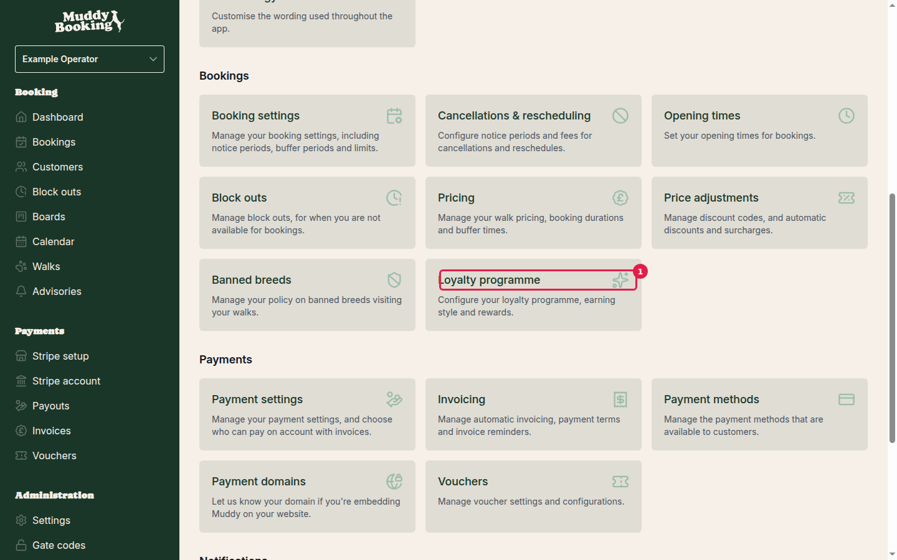
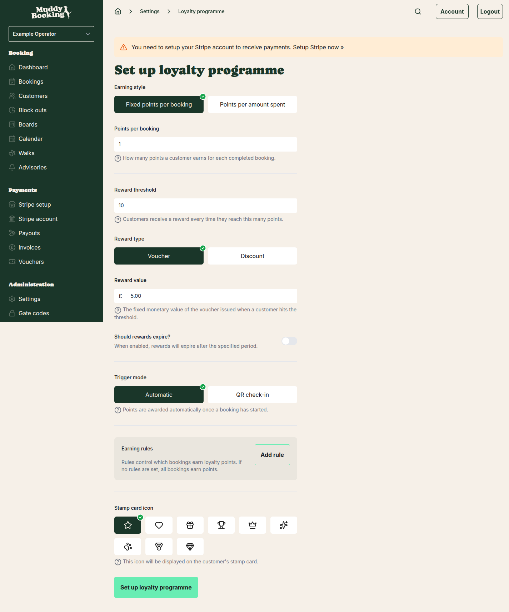
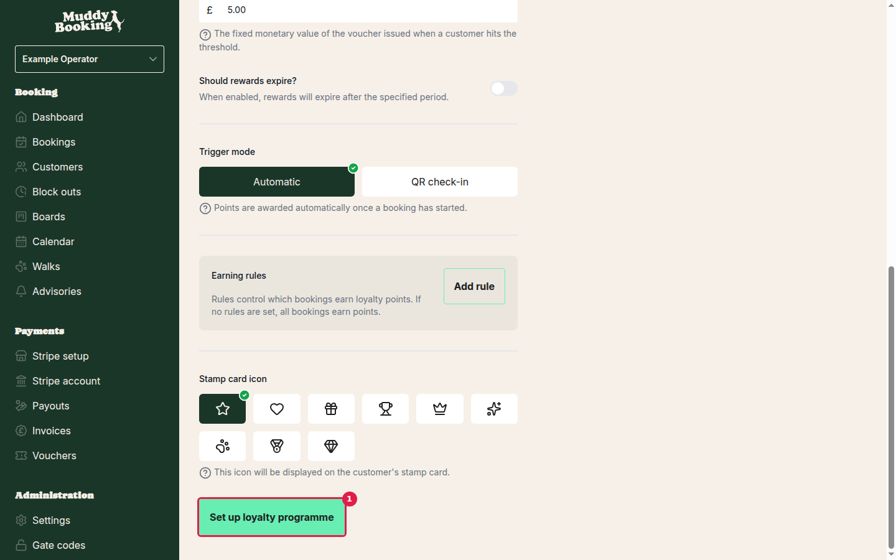
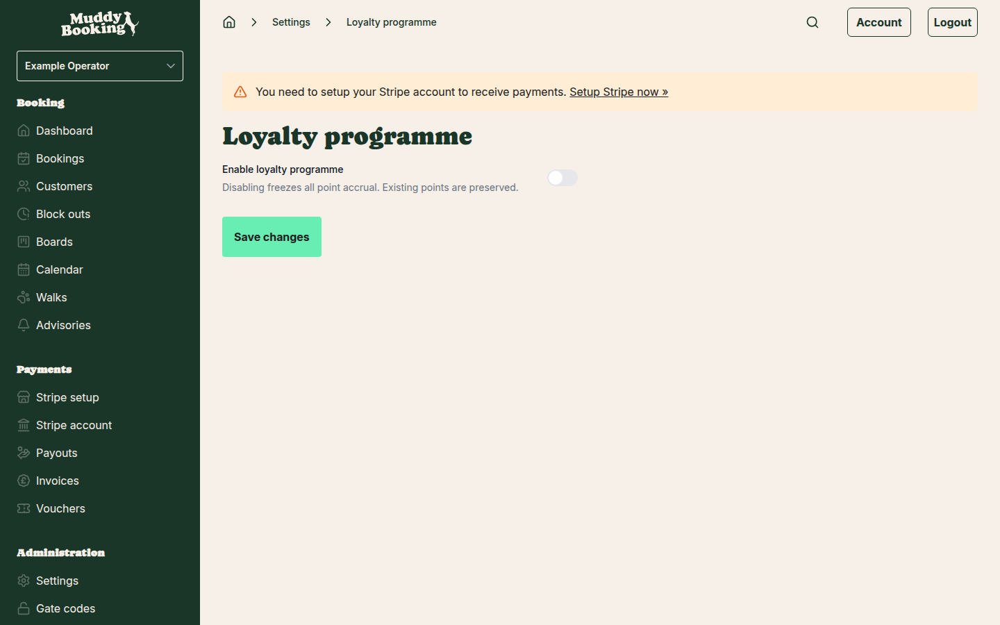

## Accessing loyalty programme settings

Go to **Settings** and click **Loyalty programme** in the Pricing section.

## Initial setup

The first time you open it, you'll see all the options with a **Set up loyalty programme** button at the bottom.

### Earning style
How customers earn points:
- **Fixed points per booking**: a set number of points for each completed booking
- **Points per amount spent**: points based on how much the booking costs

### Points per booking
How many points each completed booking earns. The default is 1.

### Reward threshold
How many points a customer needs for a reward. The default is 10. The reward is issued automatically when they reach it.

### Reward type and value
- **Voucher**: issues a [voucher](creating-vouchers.md) for a fixed amount, such as £5.00
- **Discount**: gives a percentage discount

Then enter the value of the reward.

### Additional settings
- **Reward expiry**: whether rewards expire after a set time
- **Trigger mode**: **Automatic** awards points once a booking starts. **QR check-in** awards them when you check the customer in
- **Earning rules**: limit which bookings earn points. With no rules, every booking earns points
- **Stamp card icon**: an icon shown on customers' loyalty cards

Click **Set up loyalty programme** to turn it on.

## Enabling and managing the programme

After setup, use the switch at the top of the settings page to turn the programme on or off.

**Important:** turning the programme off stops customers earning points, but keeps the points they already have. They're still there if you turn it back on.

Click **Save changes** after making any changes.

## Managing customer points

### Viewing customer loyalty status

1. Go to **Customers** in the left-hand menu
2. Click a customer

Their profile shows their points and how close they are to a reward.

### Manually adding points

You can add points yourself, for example to make up for a problem with a booking.

1. Open the customer's profile
2. Find the loyalty points section
3. Choose to adjust their points
4. Enter the number of points to add
5. Add a note saying why
6. Save

**Tip:** if the extra points take the customer past the reward threshold, their reward is issued automatically.

## Customer experience

### How customers see their progress

When logged in, customers can see on their dashboard:

- Their points balance
- How close they are to their next reward
- A stamp card
- The points they've earned and the rewards they've used

### Impersonating customers

To see exactly what a customer sees:

1. Open the customer's profile
2. Click **Impersonate**

### Viewing customer history

The customer's profile shows:

- Their bookings
- The points earned from each booking
- Rewards issued and used
- Any points you've added manually

Click **View all history** for the full timeline.

## Tips for success

- **Make rewards reachable**: if the threshold is too high, customers lose interest
- **Tell customers about it**: mention the programme on your website and in booking confirmations
- **Keep manual points for special cases**: such as making up for a problem or marking an occasion
