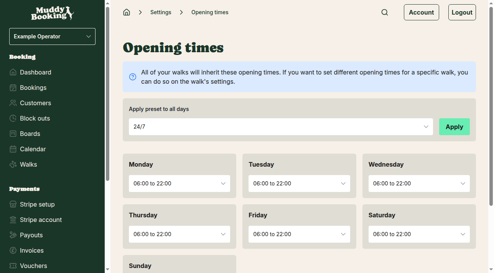
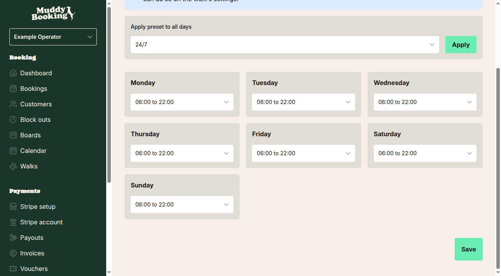
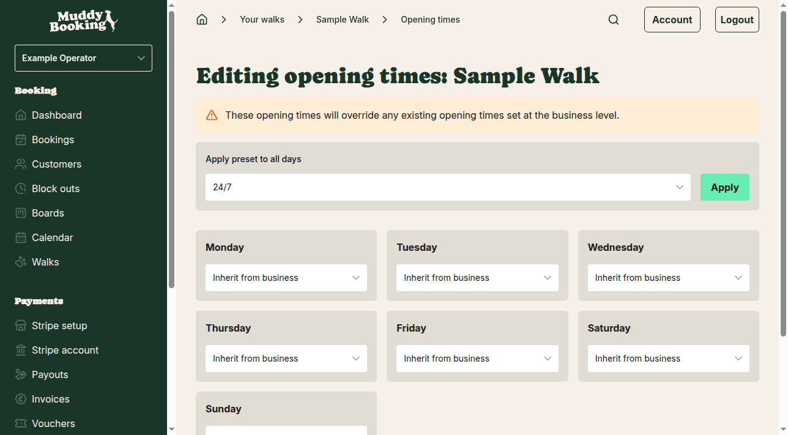
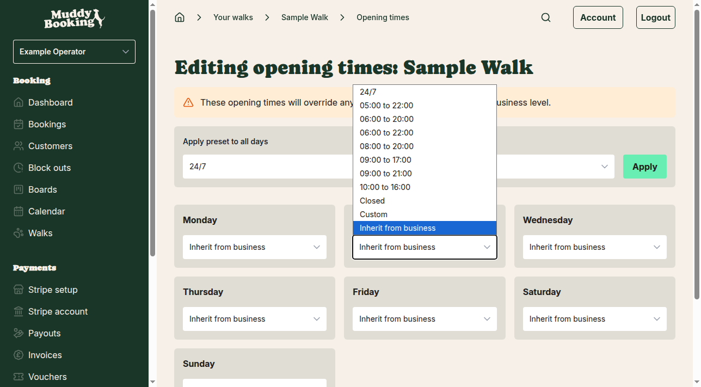

## What are opening times?

Opening times define when your customers can book appointments with your business. You can set opening times at two levels:

- **Business level** — default times that apply to all your walks
- **Walk level** — specific times for individual walks that override the business defaults

This two-level system gives you flexibility to have standard operating hours while allowing certain walks to have different availability.

## Setting business-level opening times

Business-level opening times serve as the default schedule for all your walks. To set them up:

1. Go to **Settings** from the main navigation
2. In the Bookings section, click **Opening times**

You'll see a page that lets you configure times for each day of the week. The page explains that "All of your walks will inherit these opening times. If you want to set different opening times for a specific walk, you can do so on the walk's settings."

### Using preset times for all days

The quickest way to set opening times is to apply a preset to all days at once:

1. At the top of the page, select a preset from the **Apply preset to all days** menu
2. Choose from options like **24/7**, **09:00 to 17:00**, **08:00 to 20:00**, or **Closed**
3. Click **Apply** to set that schedule across all seven days

### Setting individual days

You can also set different times for each day of the week:

1. For each day (Monday through Sunday), select from the same preset options
2. Choose **Custom** if you need specific times not covered by the presets
3. Select **Closed** for days when you're not available for bookings
4. Click **Save** at the bottom of the page to apply your changes

Available preset options include:
- **24/7** — Always available for bookings
- **05:00 to 22:00**, **06:00 to 20:00**, **09:00 to 17:00**, etc. — Various time ranges
- **Closed** — No bookings available that day
- **Custom** — Set your own specific start and end times

## Setting walk-level opening times

Walk-level opening times allow individual walks to have different availability from your business defaults. This is useful if you offer specialized walks at specific times or have walks in different locations.

### Accessing walk-level opening times

1. Go to **Walks** from the main navigation
2. Click on the walk you want to configure
3. Click the **Settings** button (this opens a side menu)
4. Select **Opening times** from the settings menu

### How walk-level times work

Walk-level opening times override business defaults. The page clearly states: "These opening times will override any existing opening times set at the business level."

For each day of the week, you have all the same preset options as business-level settings, plus one additional option:

- **Inherit from business** — Use the business-level opening times for this day

### Setting walk-specific times

You can mix and match settings for each day:

1. Use **Inherit from business** for days when the walk should follow business hours
2. Set specific times for days when this walk needs different availability
3. Use **Closed** for days when this specific walk isn't available (even if your business is open)
4. Apply presets to all days using the top section, just like business-level settings
5. Click **Save** to apply your changes

## Understanding the hierarchy

The opening times system works in a clear hierarchy:

1. **Business-level times** are your default schedule
2. **Walk-level times** override business defaults when they're set
3. **"Inherit from business"** lets a walk revert to using business times for specific days

### Example scenarios

**Scenario 1**: Your business is open 09:00 to 17:00 Monday-Friday, closed weekends
- Set business times: 09:00 to 17:00 Monday-Friday, Closed Saturday-Sunday
- All walks will automatically follow this schedule

**Scenario 2**: You have an early morning walk available from 06:00
- Business times: 09:00 to 17:00 Monday-Friday
- Early Morning Walk: 06:00 to 17:00 Monday-Friday (overrides business start time)

**Scenario 3**: One walk is only available on weekends
- Business times: 09:00 to 17:00 Monday-Friday, Closed weekends
- Weekend Walk: Closed Monday-Friday, 10:00 to 16:00 Saturday-Sunday

## Important tips

- **Start with business-level times** — Set your standard operating hours first, as these become the default for all walks
- **Use "Inherit from business"** — When creating walk-specific times, use this option for days that should follow business hours rather than leaving them blank
- **Test your settings** — Check your public booking forms to confirm customers see the correct available times
- **Changes take effect immediately** — Updated opening times apply to new bookings right away

Setting up opening times correctly ensures your customers can only book when you're actually available, preventing scheduling conflicts and improving your operational efficiency.