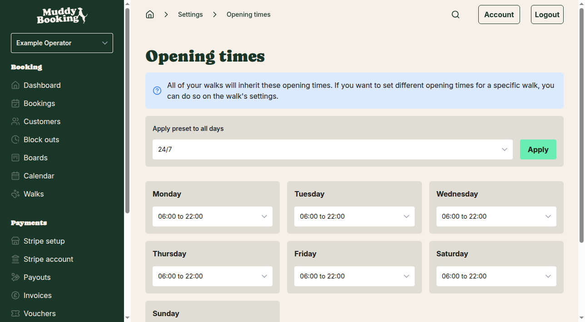
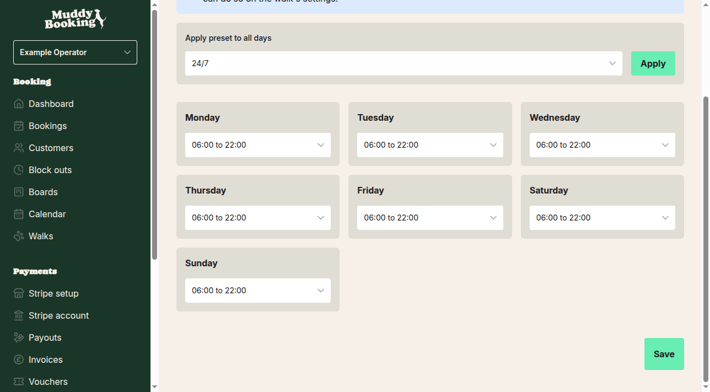
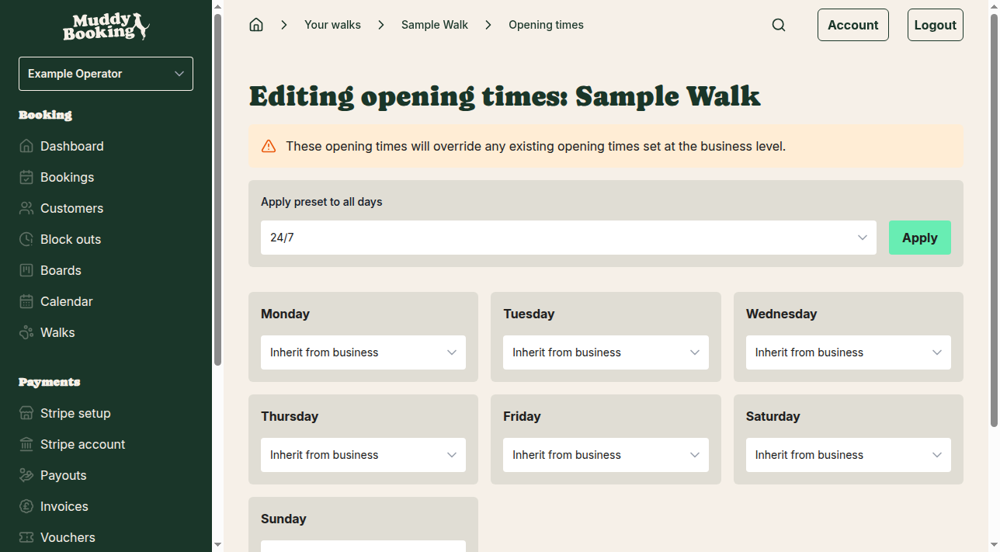
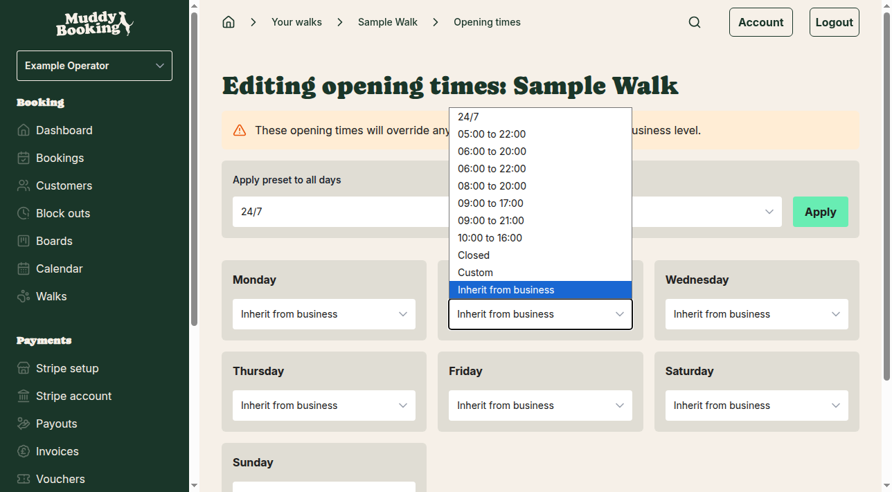

## What are opening times?

Opening times are the hours customers can book. You set them at two levels:

- **Business level**: the default for all your walks
- **Walk level**: different hours for a single walk, which replace the business times

For one-off closures such as holidays, see [How to add a block out](adding-block-outs.md).

## Setting business-level opening times

1. Go to **Settings**
2. In the Bookings section, click **Opening times**

You'll see a row for each day of the week. All your walks use these times unless you give a walk its own.

### Using preset times for all days

To set every day at once:

1. Choose a preset from the **Apply preset to all days** menu at the top of the page, such as **24/7**, **09:00 to 17:00**, **08:00 to 20:00** or **Closed**
2. Click **Apply**

### Setting individual days

For each day, choose one of:
- **24/7**: open all day
- A set range, such as **05:00 to 22:00**, **06:00 to 20:00** or **09:00 to 17:00**
- **Closed**: no bookings that day
- **Custom**: enter your own start and end times

Click **Save** at the bottom of the page.

## Setting walk-level opening times

Give a walk its own hours if it runs at different times from the rest, for example an early morning walk or a walk in another location.

### Accessing walk-level opening times

1. Go to **Walks**
2. Click the walk
3. Click **Settings**
4. Click **Opening times**

### How walk-level times work

Times set here replace the business times for this walk. Each day has the same options as at business level, plus:

- **Inherit from business**: use the business times for this day

### Setting walk-specific times

1. Choose **Inherit from business** for days the walk follows your usual hours
2. Set different times for days it doesn't
3. Choose **Closed** for days the walk isn't available, even if you're open
4. You can also use the preset menu at the top to set every day at once
5. Click **Save**

## Understanding the hierarchy

1. **Business-level times** are the default
2. **Walk-level times** replace them where set
3. **Inherit from business** makes a walk use the business times on that day

### Example scenarios

**Open weekdays only**
- Business times: 09:00 to 17:00 Monday to Friday, Closed Saturday and Sunday
- Every walk follows these times

**One walk starts earlier**
- Business times: 09:00 to 17:00 Monday to Friday
- Early Morning Walk: 06:00 to 17:00 Monday to Friday

**One walk runs at weekends only**
- Business times: 09:00 to 17:00 Monday to Friday, Closed at weekends
- Weekend Walk: Closed Monday to Friday, 10:00 to 16:00 Saturday and Sunday

## Important tips

- **Set business times first**, as every walk starts with them
- **Use Inherit from business** on walk-level days that should follow your usual hours, rather than leaving them blank
- **Check your booking form** to make sure customers see the right times
- **Changes apply straight away** to new bookings
