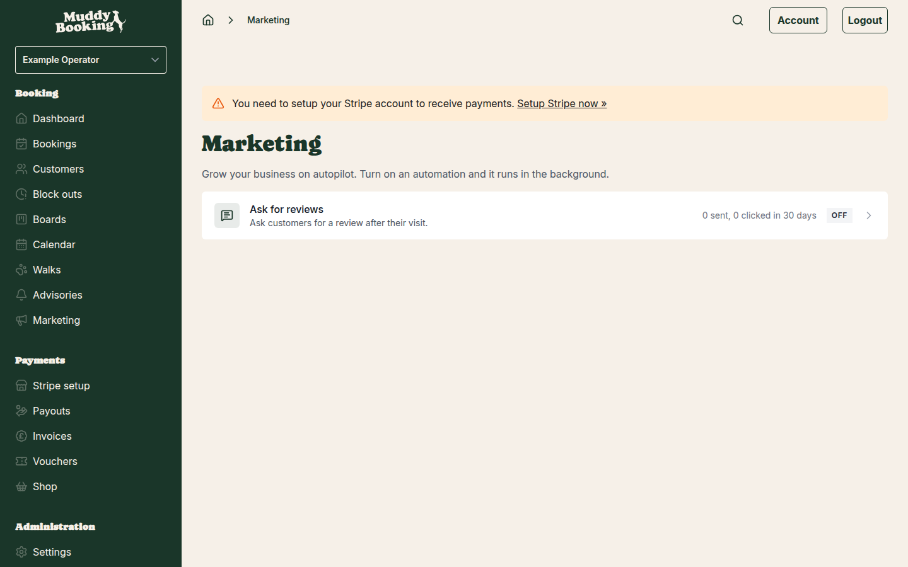
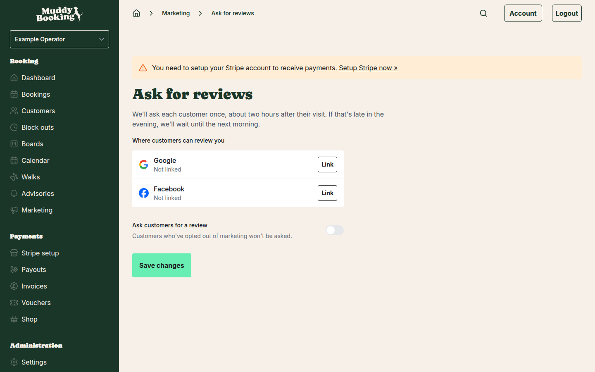

## How it works

Once you turn it on, Muddy Booking sends each customer a message about two hours after their visit ends, asking them to leave a review. The message contains a "Leave a review" button that takes them straight to Google, Facebook, or a page where they can pick which one.

A few things to know before you start:

- Each customer is only ever asked once by your business, no matter how many visits they have.
- Only visits that actually went ahead are included. Cancelled bookings and visits that never started are ignored.
- Customers who have opted out of marketing are never sent a request.
- Messages go out between 9am and 8pm in your business's time zone. If the two-hour window falls after 8pm, the message is held until 10am the next morning.
- When you first turn it on, it will only ask about visits from the last couple of days. It does not go back through your entire history.

## Finding the feature

In the left-hand menu, click **Marketing**. You will see a list of automations. **Ask for reviews** shows whether it is off, running, or needs setup, and how many requests were sent and how many customers clicked the review link in the last 30 days.

Click **Ask for reviews** to open the settings page.

## Linking your Google listing or Facebook Page

Before you can turn on review requests, you need to link at least one review platform so Muddy Booking knows where to send customers.

The page shows a row for **Google** and a row for **Facebook**, each showing whether it is linked.

### Linking Google

Click **Link** next to Google. A search box appears where you can type your business name to find your Google listing. Select the correct listing from the results. Once linked, the row shows your business name and a **View** link so you can confirm it is the right one. To switch to a different listing later, click **Change**.

### Linking Facebook

Click **Link** next to Facebook. You can either click **Connect** to log in with Facebook and select your Page, or paste your Facebook Page URL directly into the box. Once linked, the row shows your Page name and a **View** link. To switch to a different Page later, click **Change**.

You only need to link one platform to get started. If you link both, you can choose what customers see (explained in the next section).

## Turning on review requests

Once at least one platform is linked, switch on **Ask customers for a review**. The page expands to show the delivery options.

### Where customers leave reviews

If you have linked both Google and Facebook, a **Where should customers leave reviews?** option appears. Choose one:

- **Google**: all customers go straight to your Google listing.
- **Facebook**: all customers go straight to your Facebook Page.
- **Let them choose**: customers see a page in your branding with both a Google button and a Facebook button. Each button opens the review site in a new tab.

If only one platform is linked, customers always go directly to that one.

### How the request is delivered

You can turn on any combination of **Emails**, **WhatsApp**, and **SMS**. At least one must be on.

- **Emails**: a review request email is sent to the customer's email address.
- **WhatsApp**: a WhatsApp message is sent if the customer has a mobile number. The message includes a "Leave a review" button and an Unsubscribe button.
- **SMS**: a text message is sent with a link. SMS is used as a fallback when both WhatsApp and SMS are on. If a customer can receive WhatsApp, SMS is not sent to them.

WhatsApp and SMS messages use notification credits. The page will tell you if a message costs more than one credit. You can find out more about credits in [Setting up WhatsApp and SMS notifications](setting-up-whatsapp-sms-notifications.md).

When SMS is on, the page shows a preview of the SMS text that will be sent.

### Saving

Click **Save changes** to apply everything: the platform links, the on/off switch, the review destination, and the delivery channels.

## Understanding the stats

Back on the Marketing page, the **Ask for reviews** row shows:

- How many requests were **sent** in the last 30 days.
- How many were **clicked** (that is, how many customers opened the review link). Note that link previews generated automatically by apps like WhatsApp are not counted as clicks, only real customer taps are.

## Turning it off

Go to **Marketing**, click **Ask for reviews**, switch off **Ask customers for a review**, and click **Save changes**. No further requests will be sent. Customers who have already been asked will not be asked again if you turn it back on.
