## How delivery works

When a customer checks out, they choose how their order reaches them. You decide what they can choose from, and what each option costs. There are three parts to this:

- **Collection and delivery methods** **(1)**: the options customers pick from. These are your delivery methods, such as **Standard delivery** or **Next day**, and any **collection points**, where customers pick the order up from you. See [Offering collection](#offering-collection).
- **Delivery rates** **(2)**: what a delivery method costs. A rate can depend on where the order is going, how much it weighs, and how much the goods cost.
- **Places you don't deliver to** **(3)**: places inside an area you deliver to that you don't want to deliver to.

Delivery only applies to physical products. Customers buying only gift cards skip this step.

To get there:

1. Click **Shop** in the left-hand menu.
2. Click **Collection and delivery**.

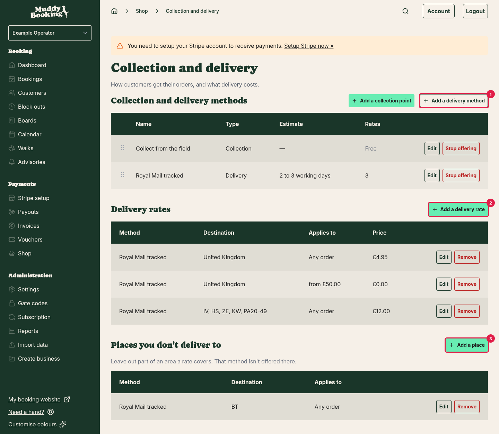

If you haven't opened your shop yet, click **Set up collection or delivery** on the **Shop** page instead. See [Setting up your shop for the first time](setting-up-your-shop.md#setting-up-your-shop-for-the-first-time).

## Step 1: Add a delivery method

1. Under **Collection and delivery methods**, click **Add a delivery method**.
2. Enter a **Name** **(1)**. Customers see this at checkout, so make it clear, such as **Royal Mail tracked** or **Standard delivery**.
3. Enter an **Estimate** **(2)** if you'd like to tell customers how long it takes, such as **2 to 3 working days**. It's shown beside the name. This is optional.
4. Click **Add method** **(3)**.

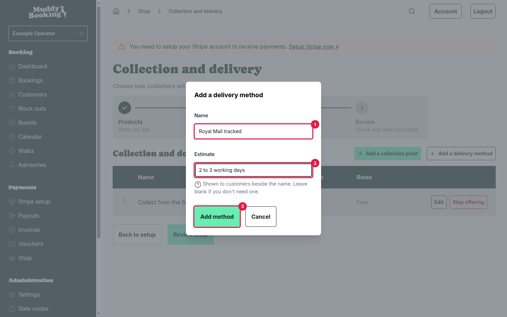

A new method has no rates, so customers can't choose it yet. The **Rates** column tells you this. Add a rate next.

You can add as many delivery methods as you like. For example, you could offer a cheaper standard option and a faster, more expensive one.

## Step 2: Add delivery rates

A rate sets what a delivery method costs, and where it applies. Every delivery method needs at least one rate. Collection points are always free, so they don't have rates, and you can't add a rate until you have at least one delivery method.

1. Under **Delivery rates**, click **Add a delivery rate**.
2. Under **Delivery method** **(1)**, choose the method this rate is for.
3. Choose where the rate applies **(2)** (see [Choosing where a rate applies](#choosing-where-a-rate-applies) below).
4. Enter the **Price** **(3)** the customer pays for delivery.
5. Set any limits on weight or order value (see [Limits](#limits) below). Leave them blank if the rate applies to every order.
6. Click **Add delivery rate** **(4)**.

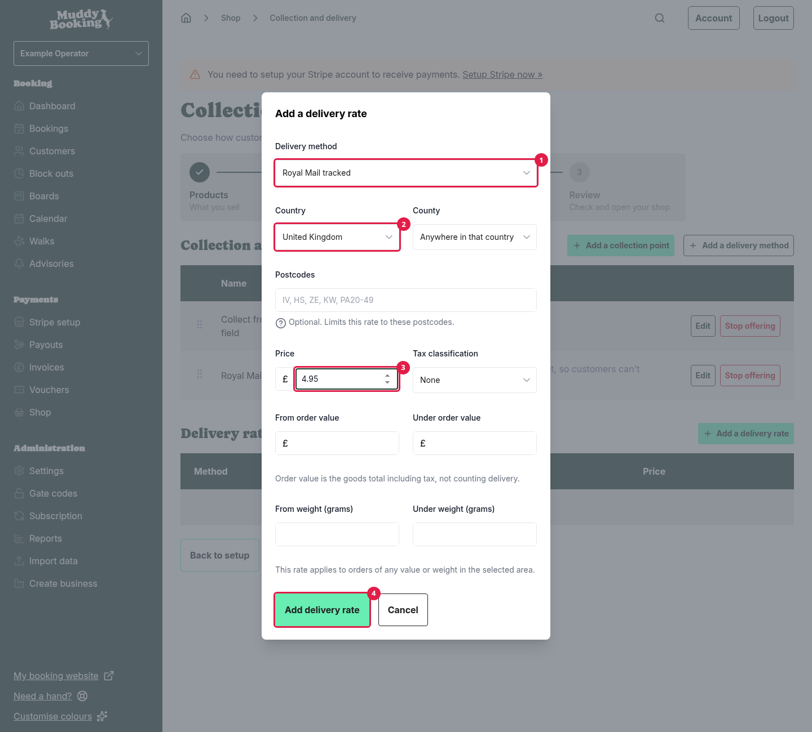

### Choosing where a rate applies

- **Country**: the country the rate covers. Choose **Everywhere else** for a rate that covers every country you haven't given its own rate.
- **County**: to cover just one county, choose it here. Leave it as **Anywhere in that country** to cover the whole country.
- **Postcodes**: to cover just some postcodes, list them here. This is optional. If you add postcodes, the rate covers only them, not the whole country or county.

### VAT

If you're VAT registered, choose the **Tax classification** for delivery. **Price includes tax** then appears, ticked. Untick it if the price you entered doesn't include VAT.

If you're not VAT registered, leave **Tax classification** as **None**.

### Limits

Limits let you charge different amounts depending on the order. There are four:

- **From order value** and **Under order value**: the cost of the goods, including VAT. The delivery charge isn't counted.
- **From weight (grams)** and **Under weight (grams)**: the total weight of the order.

An order has to meet every limit you set. "From" includes the amount you enter, and "Under" doesn't. So a rate **under £50** and another **from £50** fit together exactly, with no gap and no overlap.

**Note:** if a rate uses weight, every physical product needs a weight set. If a basket contains a physical product with no weight, rates that use weight won't apply to it. Gift cards and other products that aren't posted don't count towards the weight. Muddy warns you at the top of the **Collection and delivery** page if a rate uses weight and some of your products are missing one.

## Offering free delivery over an amount

The simplest way is to add two rates to the same delivery method:

1. A rate with your normal **Price**, such as £4.95, and **Under order value** set to **50**.
2. A rate with a **Price** **(1)** of **0**, and **From order value** **(2)** set to **50**.

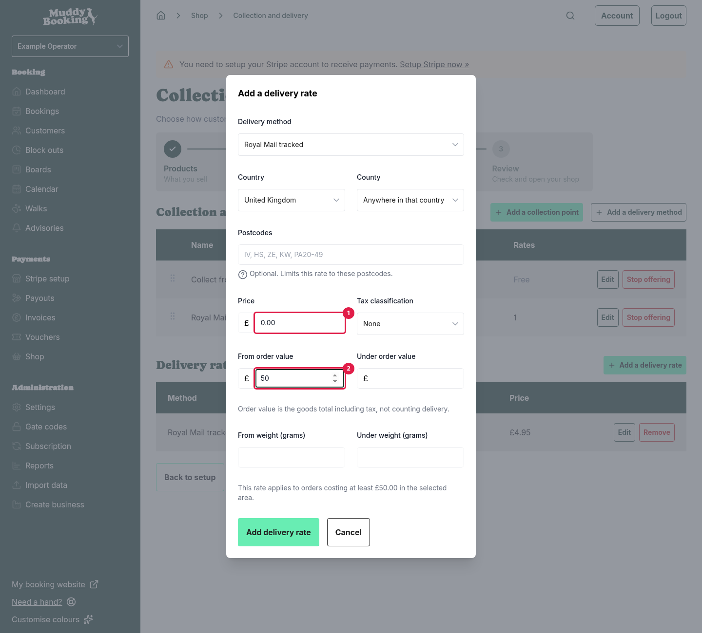

Orders under £50 pay £4.95. Orders of £50 or more see **Free** at checkout.

You can also give free delivery with a discount on delivery. Customers then see the delivery price, with the discount under it. A discount takes the charge off whichever delivery method and address the customer chooses, so faster methods and places you charge more for, such as the Highlands example below, become free too. Use rates if you only want free delivery on some methods or places. See the free delivery example in [Discounts in the shop](shop-discounts.md#examples).

Order value is what the customer pays for the goods after any discounts. So a £55 order with a £10 discount counts as £45. Gift cards in the order count towards it.

## Using postcodes

Postcodes let you charge more for hard-to-reach places, or offer local delivery to just your area.

Separate postcodes with commas. Capitals and spaces don't matter. You can list postcodes in two ways:

- **The start of a postcode**, such as **IV** or **TR18**. This covers every postcode that starts that way. **IV** covers IV1, IV2, IV36 and so on.
- **A range of districts**, such as **PA20-49**. This covers PA20, PA21 and so on, up to PA49, and nothing outside that range.

You can write a range as **PA20-49** or **PA20-PA49**. A range has to stay in one postcode area, so Muddy won't save one like **PA20-PB49**.

**Watch out:** the start of a postcode matches anything that starts the same way. **PA2** covers PA2, but also PA20 to PA29. **B** covers every postcode starting with B, including BA, BB and BD. If you need to be precise, use a range.

For example, to charge more for the Scottish Highlands and Islands, you might add a rate with the postcodes **IV, HS, ZE, KW, PA20-49** **(1)** and a **Price** **(2)** of **12**.

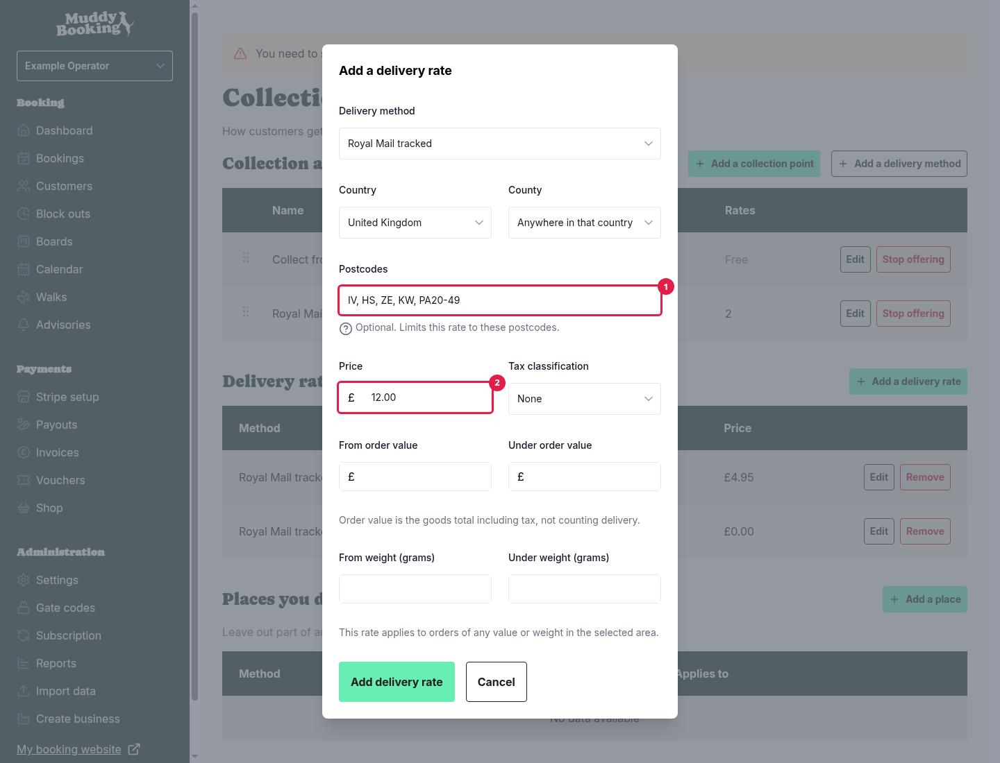

## How Muddy chooses the price

A customer might match more than one rate for the same delivery method. For example, a customer in Inverness matches both your UK rate and your Highlands postcode rate. When that happens, Muddy uses the most specific one:

1. A rate with **postcodes** comes first.
2. Then a rate for a **county**.
3. Then a rate for a **country**.
4. Then an **Everywhere else** rate.

If two rates are equally specific, the customer gets the cheaper one.

Rates that don't apply to the order (because of their limits) are ignored before Muddy chooses.

### Examples

These all use a method called **Standard delivery**.

**A UK price, plus a higher price for the Highlands**

- UK, £4.95
- UK, postcodes **IV, HS, ZE, KW, PA20-49**, £12

An order to IV2 3AB pays £12. An order to PA2 5XX pays £4.95, because PA2 isn't in the PA20 to 49 range.

**Free delivery over £50**

- UK, under £50, £4.95
- UK, from £50, £0

A £49.99 order pays £4.95. A £50 order is free.

**Free delivery over £50, and a higher price for the Highlands**

Combining the two examples above, a £60 order to IV2 pays **£12**, not nothing. The postcode rate is more specific, so it wins, and it doesn't have an order value limit.

To give the Highlands free delivery over £50 too, split the postcode rate in the same way:

- UK, postcodes **IV, HS, ZE, KW, PA20-49**, under £50, £12
- UK, postcodes **IV, HS, ZE, KW, PA20-49**, from £50, £0

## Step 3: Exclude places you don't deliver to (optional)

Sometimes a rate covers an area where you don't want to deliver. For example, you might deliver across the UK but not to Northern Ireland, or not deliver heavy orders to the islands. That's what exclusions are for.

This section is hidden while you're following the shop setup steps. To add a place before you open, click **Settings** in the left-hand menu, then **Collection and delivery**.

1. Under **Places you don't deliver to**, click **Add a place**.
2. Choose the **Delivery method** **(1)**.
3. Choose the **Country** **(2)**, **County** **(3)** or **Postcodes** **(4)** you don't want to deliver to.
4. Add any limits, if you only want to exclude some orders. For example, set **From weight (grams)** **(5)** to **2000** to stop heavy orders going there.
5. Click **Stop delivering there** **(6)**.

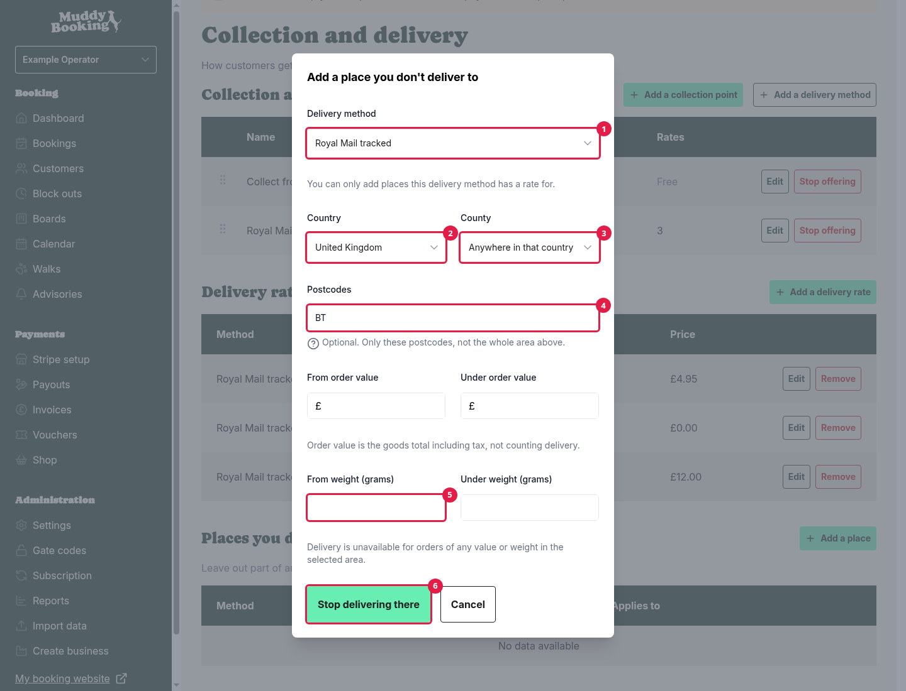

Customers in an excluded place won't be offered that delivery method.

**Note:** an exclusion that uses weight only works if every physical product in the basket has a weight. If one doesn't, Muddy can't tell how heavy the order is, so it ignores the exclusion and still offers the method there. See [Limits](#limits).

You can only exclude a place that one of your rates already covers. Add a rate for the wider area first.

Exclusions follow the same rules as rates. A more specific rate beats a less specific exclusion. So if you exclude a whole county but have a rate for some postcodes inside it, those postcodes are still delivered to. If a rate and an exclusion are equally specific, the exclusion wins.

## Offering collection

If customers can pick their orders up from you, add a **collection point**. Collection is always free, and it's offered to every customer, wherever they live.

1. Under **Collection and delivery methods**, click **Add a collection point**.
2. Enter a **Name** **(1)**, such as **Collect from the field**.
3. Enter **Instructions** **(2)** telling customers where to come and when, such as "Ring the bell at the back gate. We're open 9am to 5pm." These appear on the order and in the customer's emails.
4. Switch on **Customers help themselves** **(3)** if nobody hands the order over, for example if you leave orders in a locker or a collection box.
5. Click **Add collection point** **(4)**.

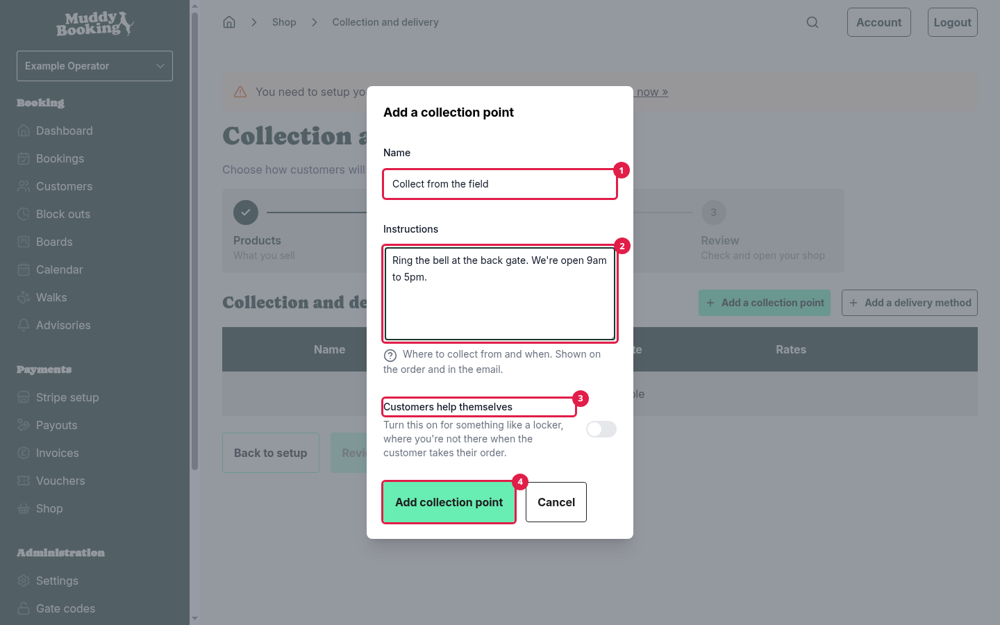

If you offer both delivery and collection, customers choose between them at checkout. If you offer only collection, customers aren't asked to choose delivery. If you have one collection point, it's chosen for them.

**Note:** the collection instructions are read when each email is sent. If you change them, emails sent after that show the new instructions, even for orders placed earlier.

To see how collection orders work once they come in, read [Managing shop orders](managing-shop-orders.md).

## Changing the order of methods

Customers see your delivery methods in the order they appear on the **Collection and delivery** page. To change it, drag a method by its handle **(1)** to a new position.

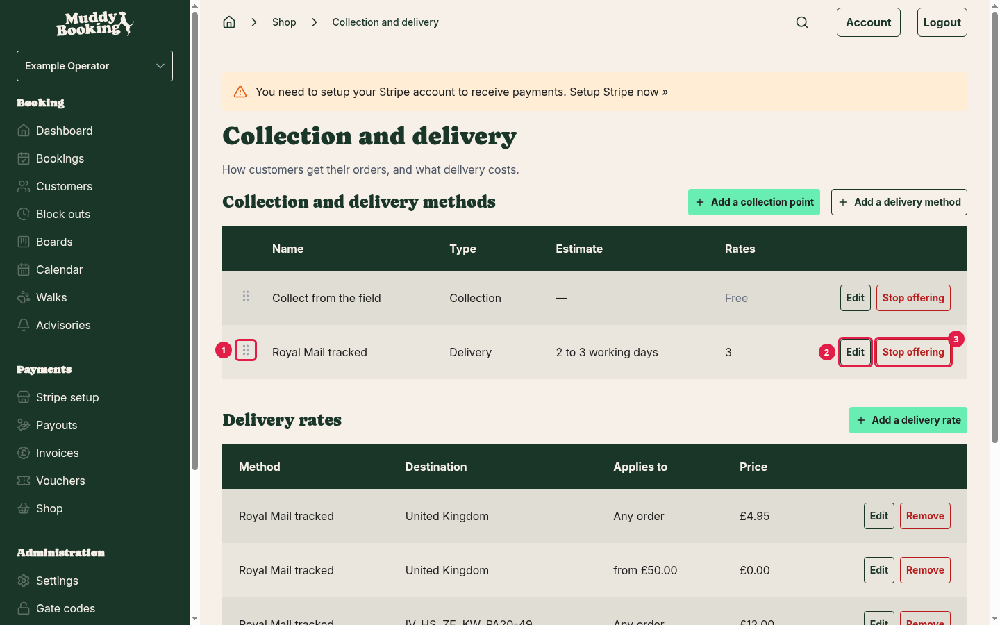

## Editing a method or rate

Click **Edit** **(2)** next to a delivery method or rate, make your changes, then click **Save changes**. Changes apply to new orders straight away. Orders already placed keep the method name and price they were charged.

You can't turn a delivery method into a collection point, or the other way round. Add a new one instead.

A rate can't be moved to a different delivery method. Remove it and add it again to the other method.

## Stopping a method

To stop offering a delivery method:

1. Click **Stop offering** **(3)** next to it.
2. Click **Stop offering it** **(1)** to confirm.

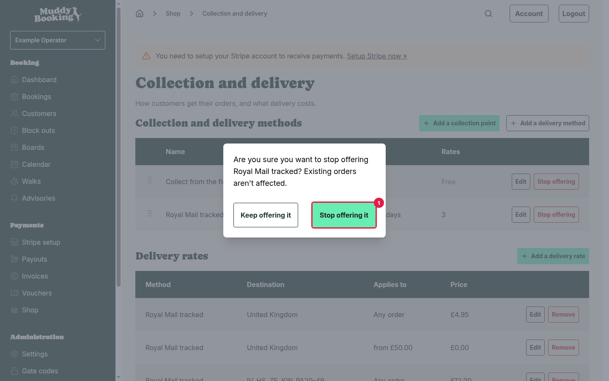

Customers can no longer choose it. Orders already sent with it keep its name. Its rates and exclusions are kept, so you can click **Offer again** **(1)** to bring it back as it was. Until then, they stay on the page, struck through.

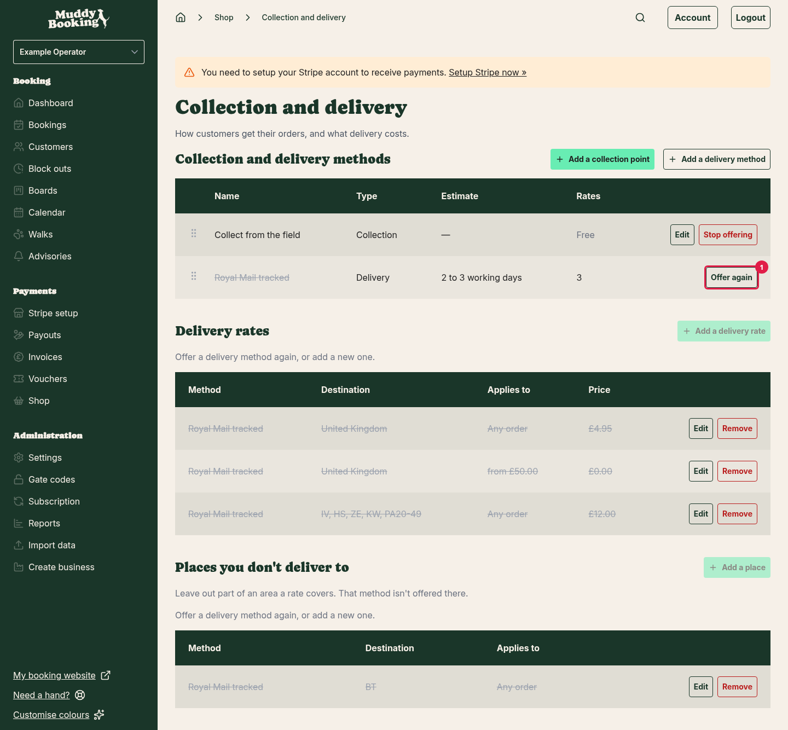

To remove a single rate, click **Remove** next to it, then **Remove it** to confirm.

**Warning:** removing a rate can't be undone. To charge it again, add it again. Orders already placed keep the price they were charged.

## What customers see at checkout

Customers enter their address, and Muddy works out which options they can have. Each option shows its name, its estimate (or collection instructions) **(1)** and its price, or **Free** **(2)**.

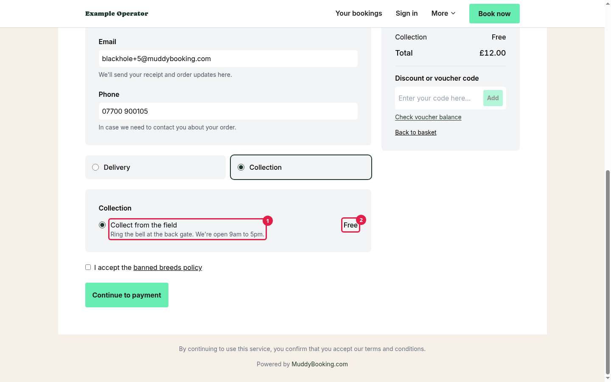

If none of your delivery methods reach the customer's address, they're told delivery isn't available there **(1)**. If you've added a **Contact email address** or **Phone number** in **Business details**, they're also invited to get in touch with you.

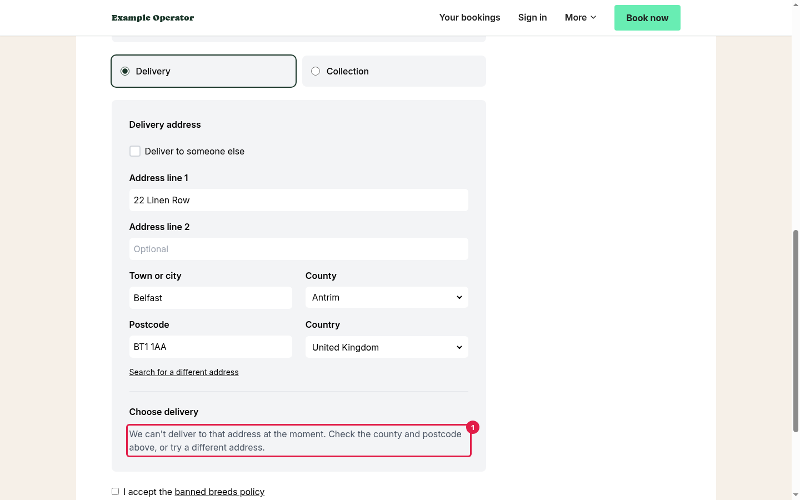

## Warnings on the shop page

Once your shop is open, Muddy warns you on the **Shop** page if delivery isn't set up properly:

- **You haven't set up collection or delivery**: you have products that need posting, but no way for customers to get them. Customers can't order those products until you add one.
- **You offer collection but no delivery**: customers can only collect. If that's what you want, click **Dismiss** **(1)** and the warning won't come back. Otherwise, click **Set up delivery** **(2)**.

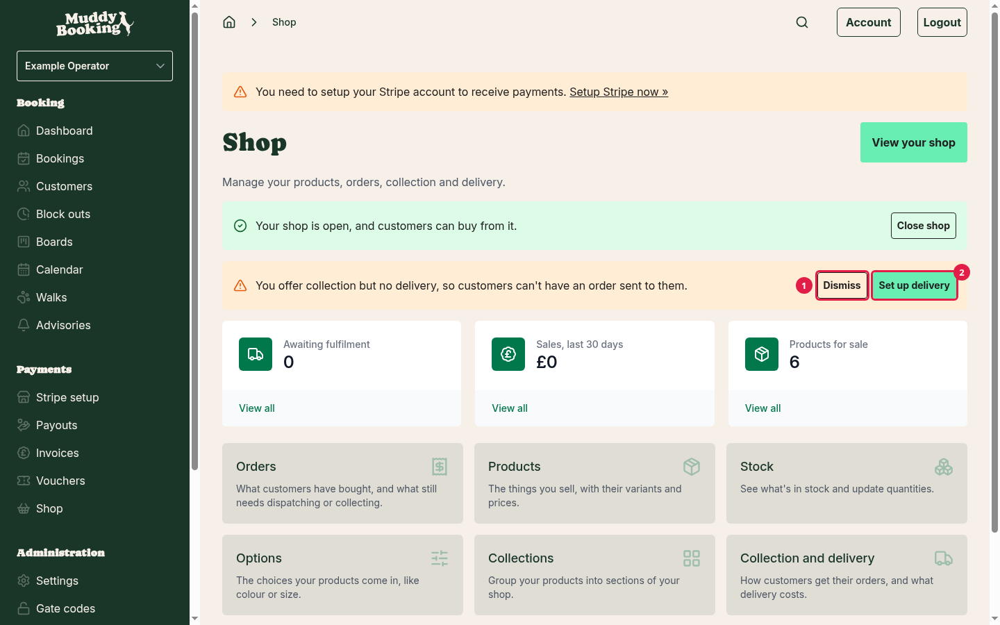
