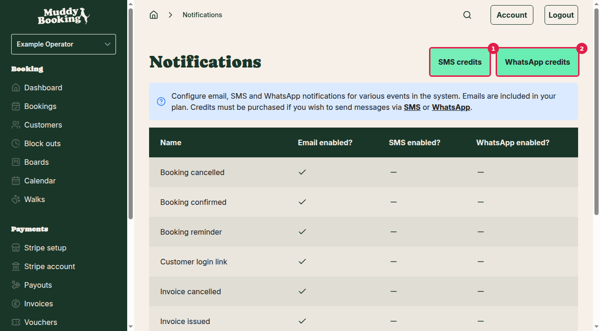
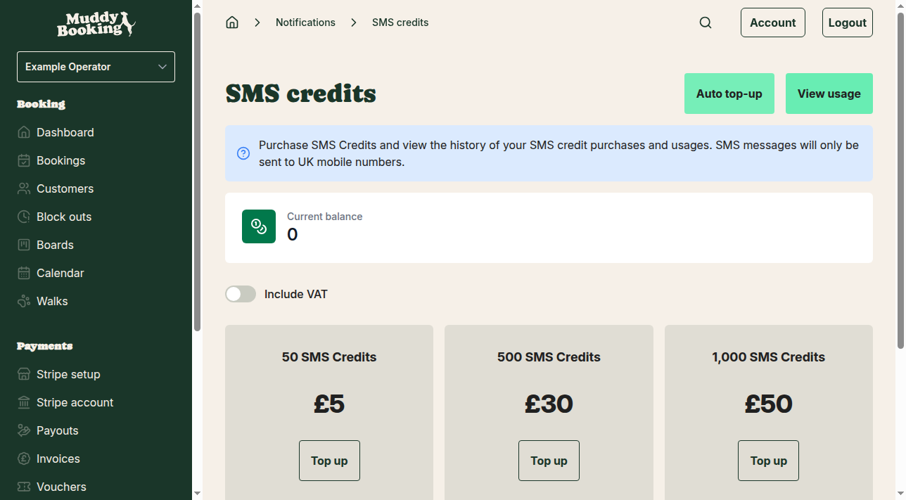
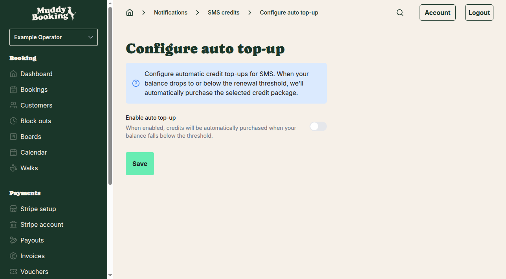
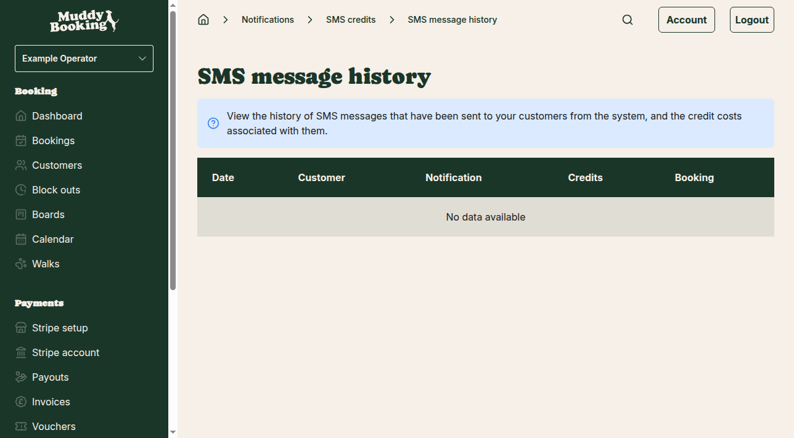
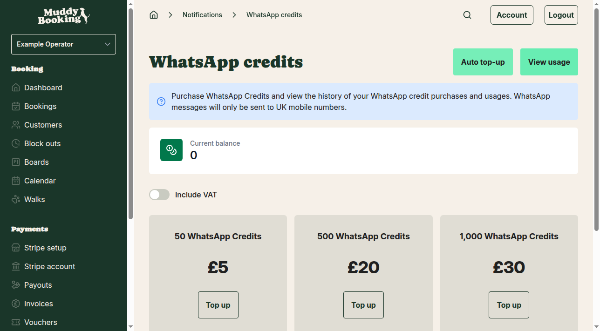
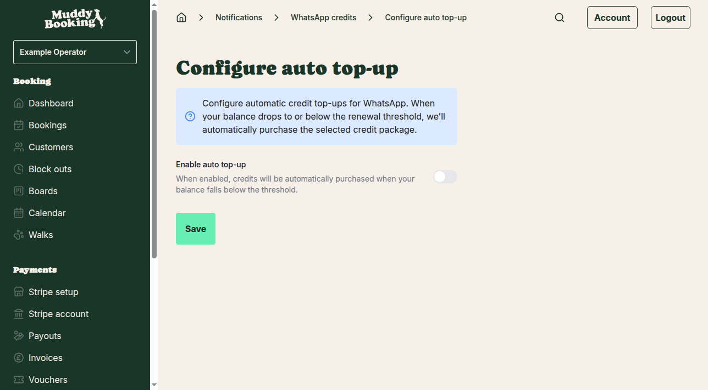
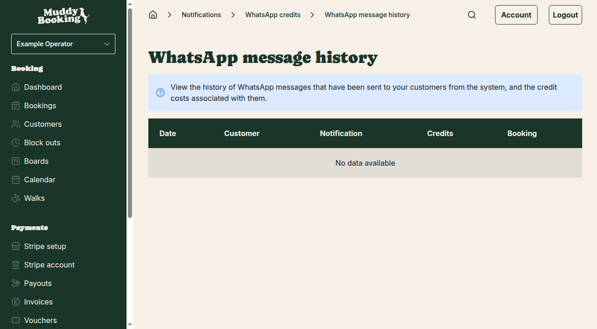

## Overview

Muddy Booking can send automated notifications to your customers via email, SMS, and WhatsApp. While email notifications are included in your plan, SMS and WhatsApp messages require purchasing credits. Both SMS and WhatsApp messages are only sent to UK mobile numbers.

## Accessing notification settings

1. Go to **Settings** from the left-hand menu
2. Scroll down to the **Notifications** section
3. You'll see three options:
   - **Notification settings** — configure which notifications to send
   - **SMS credits** — purchase and manage SMS credits
   - **WhatsApp credits** — purchase and manage WhatsApp credits

## Configuring notification types

Click **Notification settings** to choose which events trigger notifications and by which method.

The system can send notifications for various events including:
- Booking confirmations and cancellations
- Booking reminders
- Invoice notifications
- Payment confirmations
- Customer login links
- Waiting list availability alerts

For each notification type, you can choose to send it via:
- **Email** — always available at no extra cost
- **SMS** — requires credits
- **WhatsApp** — requires credits

Simply toggle the switches for each notification type to enable or disable the different delivery methods.

## Setting up SMS notifications

### Purchasing SMS credits

1. From the Settings page, click **SMS credits** **(1)**
2. You'll see your current credit balance and purchase options

Choose from these credit packages:
- **50 SMS credits** — £5
- **500 SMS credits** — £30  
- **1,000 SMS credits** — £50

Click **Top up** next to your preferred package to purchase credits.

**Important notes:**
- All prices exclude VAT
- Credits expire 12 months after purchase
- SMS messages only work with UK mobile numbers

### Setting up automatic top-up for SMS

To avoid running out of credits, you can enable automatic top-ups:

1. From the SMS credits page, click **Auto top-up**
2. Configure your automatic renewal settings

When enabled, the system will automatically purchase more credits when your balance falls below your chosen threshold.

### Viewing SMS usage history

To see how many SMS credits you've used:

1. From the SMS credits page, click **View usage**
2. Review the detailed history showing when messages were sent and to whom

The usage history shows:
- Date and time of each message
- Which customer received it
- What type of notification it was
- How many credits were used
- Associated booking (if applicable)

## Setting up WhatsApp notifications

### Purchasing WhatsApp credits

1. From the Settings page, click **WhatsApp credits** **(2)**
2. You'll see your current credit balance and purchase options

WhatsApp credit packages are more affordable than SMS:
- **50 WhatsApp credits** — £5
- **500 WhatsApp credits** — £20
- **1,000 WhatsApp credits** — £30

Click **Top up** next to your preferred package to purchase credits.

**Important notes:**
- All prices exclude VAT
- Credits expire 12 months after purchase
- WhatsApp messages only work with UK mobile numbers

### Setting up automatic top-up for WhatsApp

1. From the WhatsApp credits page, click **Auto top-up**
2. Configure your automatic renewal settings

The auto top-up works the same way as SMS — when your balance drops below the threshold, new credits are automatically purchased.

### Viewing WhatsApp usage history

1. From the WhatsApp credits page, click **View usage**
2. Review the detailed message history

The usage tracking provides the same detailed information as SMS, showing exactly when messages were sent and how many credits were used.

## Best practices

### Credit management
- Monitor your credit usage regularly, especially when first setting up notifications
- Enable auto top-up to prevent notifications from failing due to insufficient credits
- Choose larger credit packages for better value if you send many notifications

### Notification strategy
- Start with email notifications only, then add SMS/WhatsApp based on customer preferences
- Booking confirmations and reminders are typically the most valuable notifications to enable
- Consider your customer demographics — some may prefer WhatsApp over SMS

### Cost considerations
- WhatsApp credits are more cost-effective than SMS
- Email notifications are free, so always enable those as a backup
- Track usage for the first month to understand your credit consumption patterns

## Troubleshooting

**Messages not being sent:**
- Check you have sufficient credits
- Verify the customer's mobile number is a UK number
- Confirm the notification type is enabled in notification settings

**High credit usage:**
- Review which notification types are enabled
- Check if you're sending unnecessary notifications (like invoice reminders for customers who pay immediately)
- Consider whether all notification types need both SMS and WhatsApp enabled