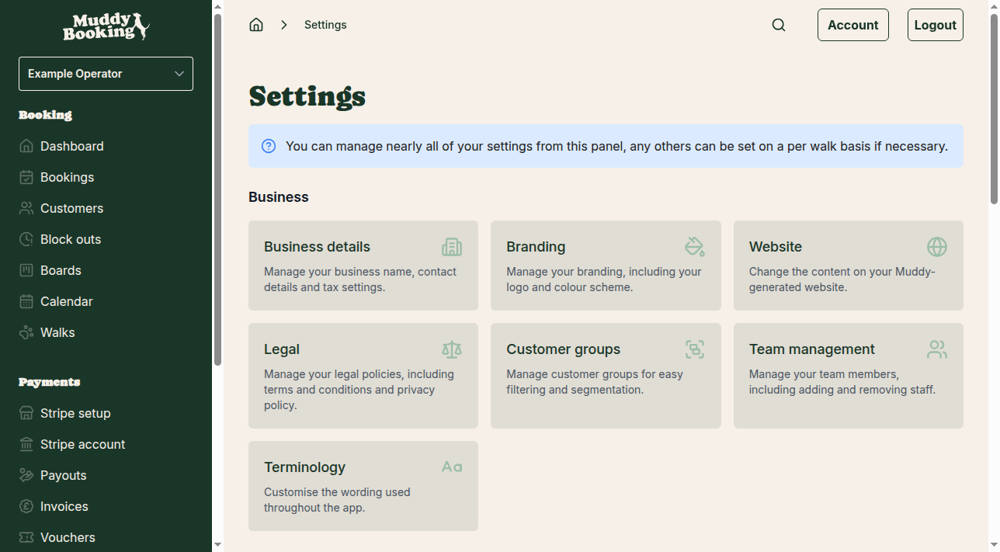
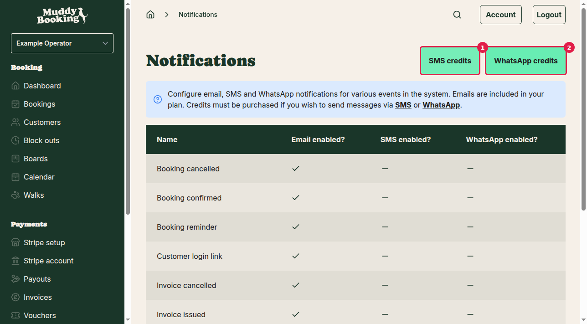
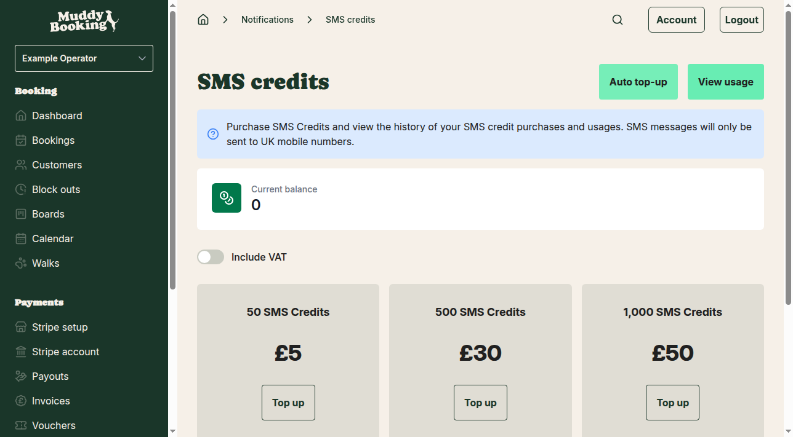
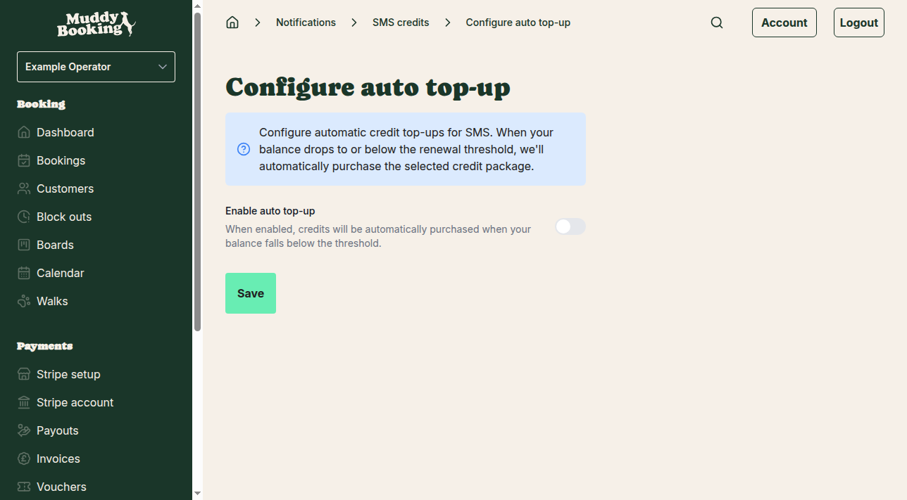
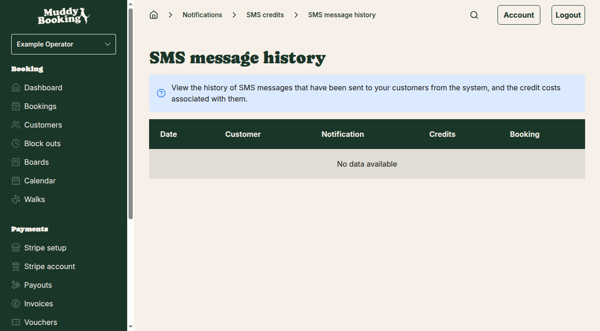
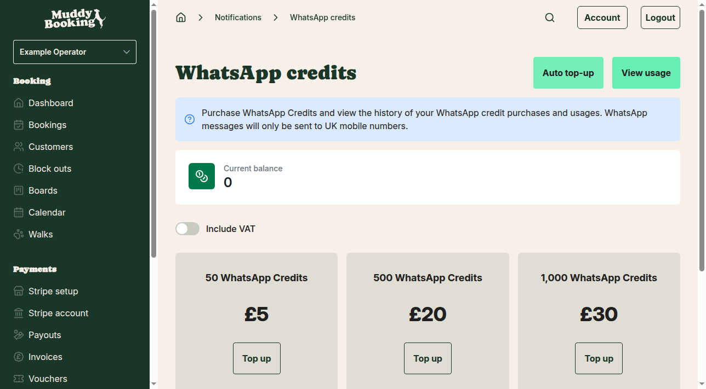
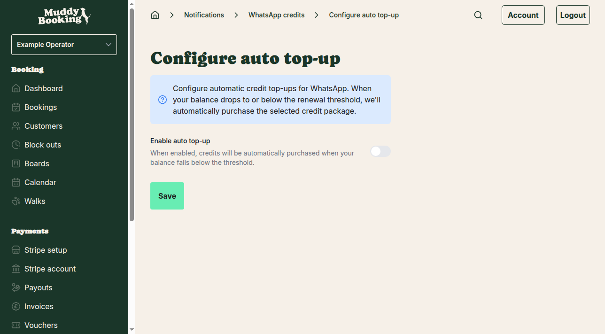
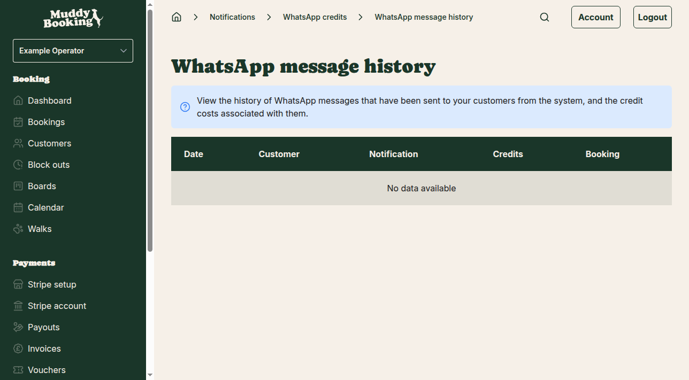

## Overview

Muddy can send notifications to your customers by email, SMS and WhatsApp. Email is included in your plan. SMS and WhatsApp use credits, which you buy, and only send to UK mobile numbers.

## Accessing notification settings

1. Go to **Settings** in the left-hand menu
2. Scroll down to the **Notifications** section, which has:
   - **Notification settings**: choose which notifications to send
   - **SMS credits**: buy and manage SMS credits
   - **WhatsApp credits**: buy and manage WhatsApp credits

## Configuring notification types

Click **Notification settings** to choose which notifications are sent and how.

Notifications include:
- Booking confirmations and cancellations
- Booking reminders
- [Invoices](invoicing-and-automatic-payments.md)
- Payment confirmations
- Customer login links
- Waiting list alerts

Each can be sent by:
- **Email**: free
- **SMS**: uses credits
- **WhatsApp**: uses credits

Use the switches to turn each method on or off for each notification.

## Setting up SMS notifications

### Purchasing SMS credits

1. On the Settings page, click **SMS credits** **(1)**. You'll see your balance and the packages available

2. Choose a package and click **Top up**

**Important notes:**
- Prices exclude VAT
- Credits expire 12 months after purchase
- SMS only sends to UK mobile numbers

### Setting up automatic top-up for SMS

Auto top-up buys more credits when your balance falls below a level you choose, so you don't run out.

1. On the SMS credits page, click **Auto top-up**
2. Choose your settings

### Viewing SMS usage history

On the SMS credits page, click **View usage**.

For each message you'll see:
- When it was sent
- Which customer it went to
- What type of notification it was
- How many credits it used
- The booking it relates to, if any

## Setting up WhatsApp notifications

### Purchasing WhatsApp credits

1. On the Settings page, click **WhatsApp credits** **(2)**. You'll see your balance and the packages available

2. Choose a package and click **Top up**

WhatsApp credits cost less than SMS credits.

**Important notes:**
- Prices exclude VAT
- Credits expire 12 months after purchase
- WhatsApp only sends to UK mobile numbers

### Setting up automatic top-up for WhatsApp

1. On the WhatsApp credits page, click **Auto top-up**
2. Choose your settings

It works the same way as for SMS.

### Viewing WhatsApp usage history

On the WhatsApp credits page, click **View usage**. It shows the same details as SMS usage.

## Best practices

- **Turn on both WhatsApp and SMS, with credits for each.** Messages go by WhatsApp first and fall back to SMS if the customer doesn't have WhatsApp. As WhatsApp is cheaper, this reaches the most customers for the least money.
- **Start with booking confirmations and reminders.** They're the most useful to customers.
- **Emails are sent as well** as SMS and WhatsApp, at no extra cost.
- **Turn on auto top-up** so notifications don't stop when your credits run out.
- **Keep an eye on usage for the first month** to see how many credits you get through. If you send a lot, larger packages are better value.

## Troubleshooting

**Messages aren't being sent:**
- Check you have enough credits
- Check the customer's mobile number is a UK number
- Check the notification is switched on in **Notification settings**

**You're using a lot of credits:**
- Check which notifications are switched on
- Turn off SMS and WhatsApp for notifications that don't need them, such as cancellation confirmations
