## What the shop is

Your shop lets customers buy products from your own website, alongside their bookings. You might sell treats, leads, towels, branded merchandise or gift cards. Customers pay by card (or Apple Pay and Google Pay) and choose delivery or collection. You then see each order in Muddy and record it when it goes out.

The shop lives on the same website as your booking pages. It isn't a separate site, and customers don't need a separate account to use it.

To get there, click **Shop** **(1)** in the left-hand menu. It sits in the **Payments** section, below **Vouchers** (and **Loyalty points**, if you use them).

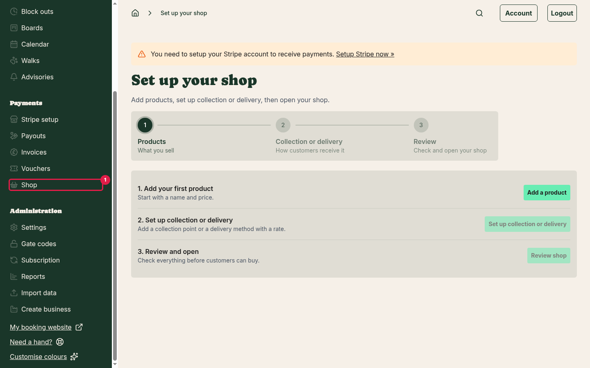

## Setting up your shop for the first time

Your shop starts closed, so you can set everything up before customers see it. Until you open it for the first time, the **Shop** page is called **Set up your shop** and walks you through three steps. A bar across the top shows which step you're on.

**Tip:** you need a Stripe account connected before customers can pay by card. If you already take card payments for bookings, you're set. If not, click **Stripe setup** in the left-hand menu first.

### Step 1 - Add your first product

1. Click **Shop** in the left-hand menu.
2. Under **1. Add your first product**, click **Add a product** **(1)**.

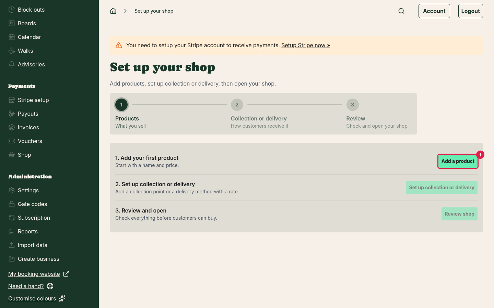

3. Choose the **Product type** **(1)**, enter a **Product name** **(2)**, and fill in the rest of the product's details. See [Adding products and variants](adding-shop-products.md), or [Selling gift cards](selling-gift-cards.md) for gift cards.

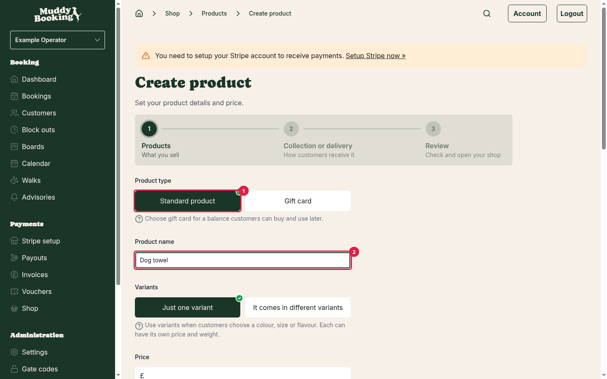

4. Click **Save and continue** **(1)**.

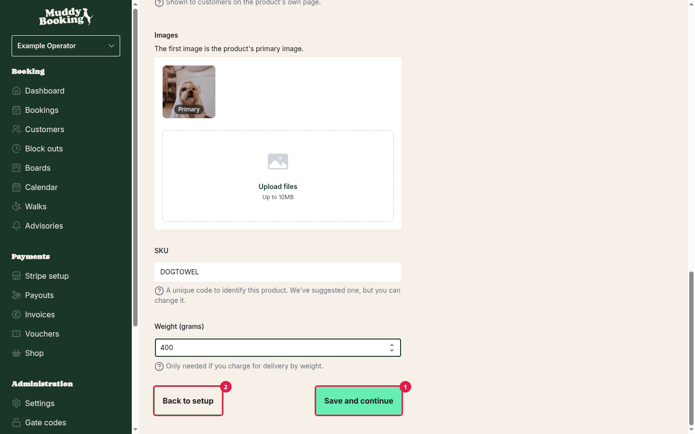

Muddy takes you straight on to the next step. To add more products first, click **Back to setup** **(2)**, then **Review products**, and add them from the **Products** page.

While you're setting up, the **Products** page shows the same step bar. Click **Back to setup** **(1)** to return to the checklist, or **Continue** **(2)** when you're done.

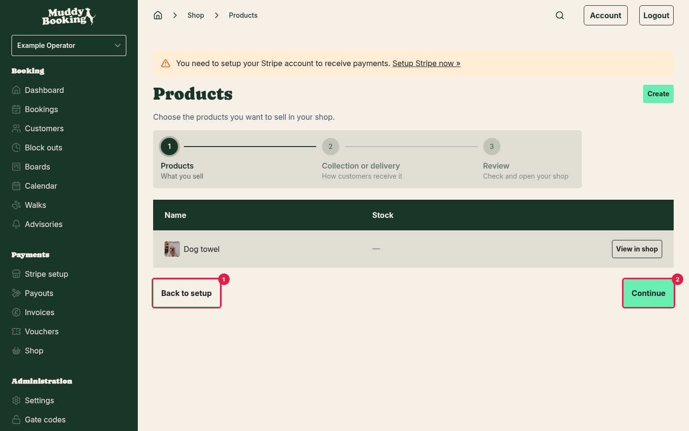

### Step 2 - Set up collection or delivery

Customers need a way to get anything physical you sell. Add at least one collection point, or a delivery method with a rate. See [Setting up delivery and collection](setting-up-shop-delivery.md).

1. Under **2. Set up collection or delivery**, click **Set up collection or delivery** **(1)**. If you want to add more products first, click **Review products** **(2)** instead.

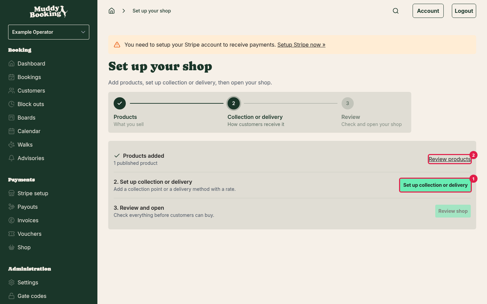

2. Add a collection point **(1)**, or a delivery method **(2)** and then a rate for it. **Back to setup** **(3)** takes you back to the checklist. **Review shop** **(4)** works once customers have a way to get their order.

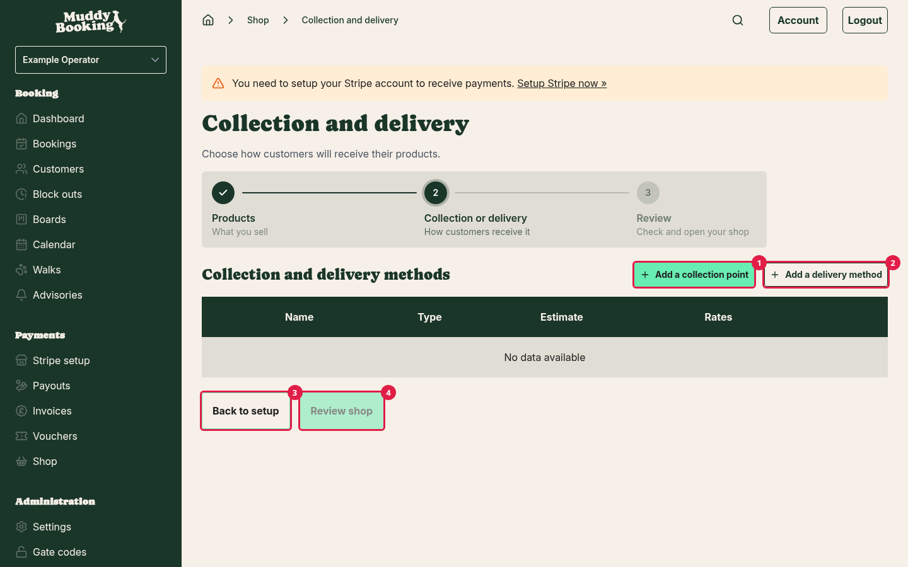

3. When you've added them, click **Review shop** **(1)**.

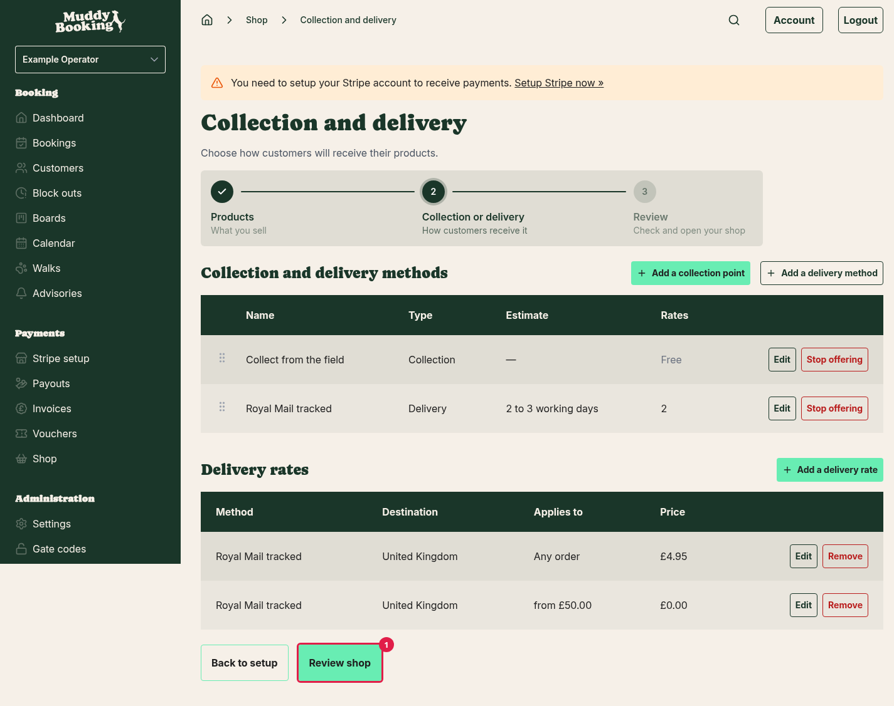

If you only sell things that don't need posting, such as gift cards, Muddy skips this step and shows **Not needed for your current products**.

### Before you open

Setup doesn't check these, but they're worth doing before customers arrive:

- **Group your products into collections.** This makes your shop front much easier to browse. See [Organising your shop with collections](organising-shop-collections.md).
- **Check your legal policies.** Your terms and conditions and other policies show at checkout (more on this below). See [Setting up legal documents](setting-up-legal-documents.md).

While you're setting up, you can reach **Products** through **Review products**. **Options**, **Collections** and **Collection and delivery** are also under **Settings** in the left-hand menu. The rest of the shop's pages, including **Stock**, appear on the **Shop** page once your shop is open. If you track stock, set it as soon as you open. See [Tracking stock](tracking-shop-stock.md).

### Step 3 - Review and open

1. Under **3. Review and open**, click **Review shop** **(1)**. The button works once you have a product to sell and, if you need it, collection or delivery.

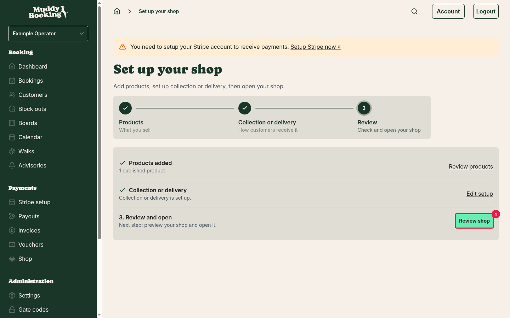

2. The **Review your shop** page lists your products and your collection and delivery methods. Click **Change** **(1)** next to either to go back to it.
3. Click **Preview shop** **(2)** to see your shop as a customer would (see below).
4. Click **Open shop** **(3)**.

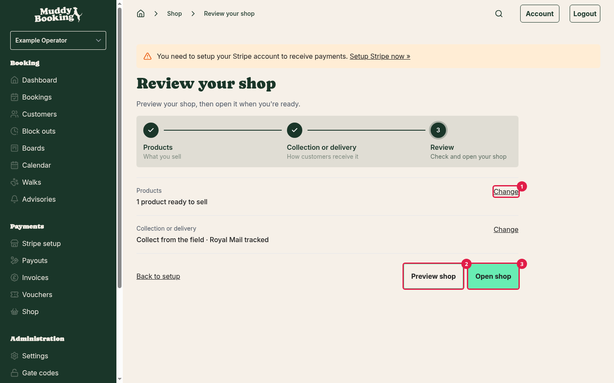

5. Click **Open it** **(1)** to confirm.

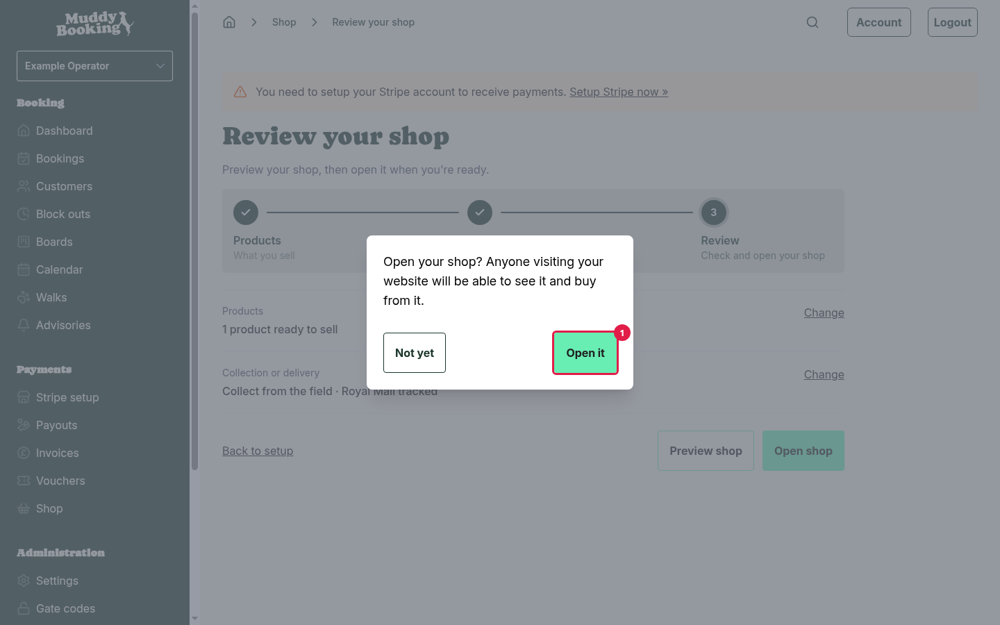

Anyone visiting your website can now see the shop and buy from it. A **Shop** link appears in your website's menu, and a **Your orders** link appears in the customer account menu.

From now on, changes you make go live straight away. That includes prices, products, delivery charges and the order of your collections, so it's worth making big changes carefully.

## The shop page

Once your shop is set up, the **Shop** page is your starting point. At the top you'll see a few figures:

- **Awaiting fulfilment** - paid orders you still need to send or hand over.
- **Sales, last 30 days** - what customers have paid for orders in the last 30 days.
- **Products for sale** - published products in your shop.

Below the figures are links to every part of the shop:

- **Orders** - what customers have bought and what still needs to go out.
- **Products** - the things you sell.
- **Stock** - how many of each thing you have.
- **Options** - the choices a product comes in, like colour or size.
- **Collections** - the sections of your shop front.
- **Collection and delivery** - how customers get their orders, and what delivery costs.
- **Discounts** - money off, by code or automatically. Discounts can apply to bookings too, so they live in your settings rather than inside the shop.
- **Settings** - how your order numbers look.

## Previewing your shop

You can look at your shop exactly as a customer would before anyone else can.

- While you're setting up, click **Preview shop** on the **Review your shop** page.
- After that, click **Shop** in the left-hand menu, then **Preview your shop** at the top of the page.

Your shop opens in a new tab. A banner at the top **(1)** reminds you that you're previewing, and shows pages customers may not be able to see yet.

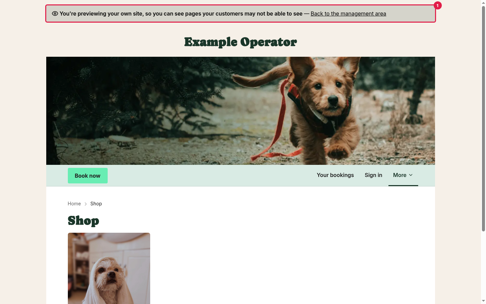

The preview lasts 30 minutes, then you'll need to click the preview button again.

Once your shop is open, the button on the **Shop** page says **View your shop** instead.

## Opening your shop again

If you've closed your shop since you first opened it:

1. Click **Shop** in the left-hand menu.
2. Click **Open shop** in the yellow box.
3. Click **Open it** to confirm.

## Closing your shop

You can close your shop at any time, for example while you're away or restocking.

1. Click **Shop** in the left-hand menu.
2. Click **Close shop** in the green box.
3. Click **Close it** to confirm.

Closing the shop doesn't delete anything. Your products, collections, delivery settings and orders all stay as they are, ready for when you open again.

While the shop is closed:

- The **Shop** and **Your orders** links disappear from your website's menu.
- Anyone who visits a shop page sees a "page not found" message. Nothing mentions that you have a shop.
- Customers can still open the link in their order emails to check on an order they've already placed.
- You still manage your existing orders as normal.

**Note:** your shop only stays open while your Muddy subscription is active. If your subscription lapses, customers see the shop as closed, even though your **Shop** page still says it's open. Once your subscription is active again, the shop comes back with nothing lost.

## Where customers find your shop

Your shop is at the **/shop** page of your Muddy website. When it's open, customers reach it from the **Shop** link in your website's menu.

If you've embedded Muddy on your own website (for example on [WordPress](embedding-on-wordpress.md) or [Squarespace](embedding-on-squarespace.md)), the **Shop** link isn't shown inside the embedded booking form. Instead, add your shop to a page on your website and link to that page from your website's menu. See [Adding your shop to your website](adding-your-shop-to-your-website.md).

## Terms and policies at checkout

The checkout shows the legal policies you've published (terms and conditions, privacy policy, and your banned breeds and cancellation policies if you have them). How they appear depends on one setting:

1. Go to **Settings**.
2. Click **Legal**.
3. Look at **Require acceptance**.

- **Require acceptance on** - customers must tick **I accept the…** before they can continue to payment. This is the same setting that applies to bookings.
- **Require acceptance off** - customers see **By continuing, you accept our…**, with links to each policy, but don't need to tick anything.

If you haven't published any policies, nothing is shown.

**Note:** Apple Pay and Google Pay buttons always show the **By continuing, you accept our…** wording, even when **Require acceptance** is on. This is because the wallet takes over the payment in one step.

## Order numbers

Every order gets a number, like **#1042**. Customers see it on their receipt and in emails, and it's what they'll quote if they get in touch. You can change how it looks.

1. Click **Shop** in the left-hand menu.
2. Click **Settings**.

### Order number prefix

The letters or symbols shown in front of the number. For example, a prefix of **MW-** gives order numbers like **MW-1042**. Leave it blank to use **#**.

You can use up to 10 characters: letters, numbers, spaces, and the characters **- / _ #**. Changing the prefix only affects new orders. Orders you've already taken keep the number they were given.

### Next order number

The number your next order uses. This is handy if you're moving from another shop and want your numbering to carry on from where it left off. Leave it empty to carry on from your last Muddy order.

It has to be higher than any order number you've already used. After the next order takes the number, numbering carries on from there automatically.

The **Example** box shows what your next order number will look like as you type. Click **Save** when you're happy.

## Emails you'll get

These go to the admin users on your account. Each person can switch off the ones marked below from their profile, under **Notification preferences**.

- **New shop order** - when a customer pays for an order. Listed as **Shop order placed** in your preferences, and can be switched off.
- **Order could not be completed** - if a customer paid but something went wrong on our side. The payment is kept, but the customer hasn't been sent a confirmation. Contact support if you get one of these. You can't switch this email off.
- **Not enough stock for order #1042** - if two customers bought the last of something at the same time. See [Tracking stock](tracking-shop-stock.md). Can be switched off.
