## Why this is worth reading

It helps to know what your customers see, so you can answer their questions and set your shop up well. The easiest way to see it for yourself is to preview your shop (see [Setting up your online shop](setting-up-your-shop.md)).

Your shop carries your name and [branding](customizing-branding-and-website.md), not Muddy's. Emails to customers come from your business too.

## Browsing

Customers reach your shop from the **Shop** link in your website's menu.

The shop front shows each of your collections as a section, with up to four products each, and a **View all** link when there are more. Products that aren't in a collection are listed under **More products** at the end.

Each product shows its main image, its name and its price. If the price depends on which variant the customer picks, it shows **From** **(1)** the lowest price.

Customers reach their basket from the **Basket** button **(2)** at the top of the page.

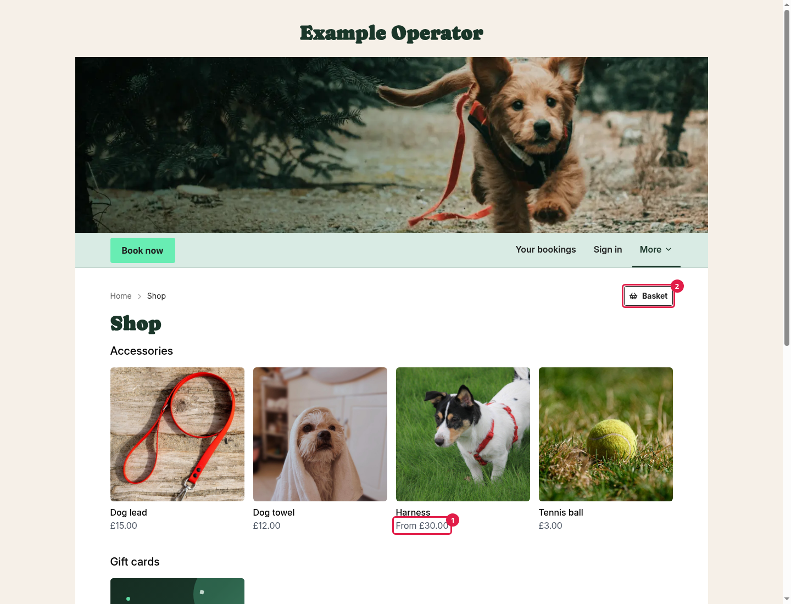

## The product page

On a product's page, customers see your images and description, and choose from its options, such as size **(1)** and colour **(2)**. Combinations that are out of stock, or that you don't sell, are greyed out.

If you track stock, customers see how many are left (**8 in stock** **(3)**, or **10+ in stock** when you have plenty). When a product has run out completely, they see **Out of stock**.

To buy, they click **Add to basket** **(4)**.

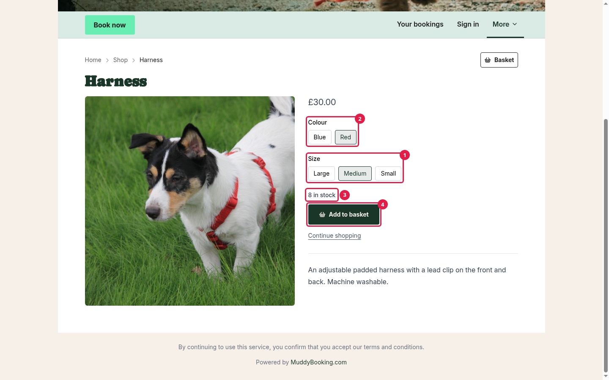

The button then changes so they can change the quantity **(1)**, and a **View basket** **(2)** button appears.

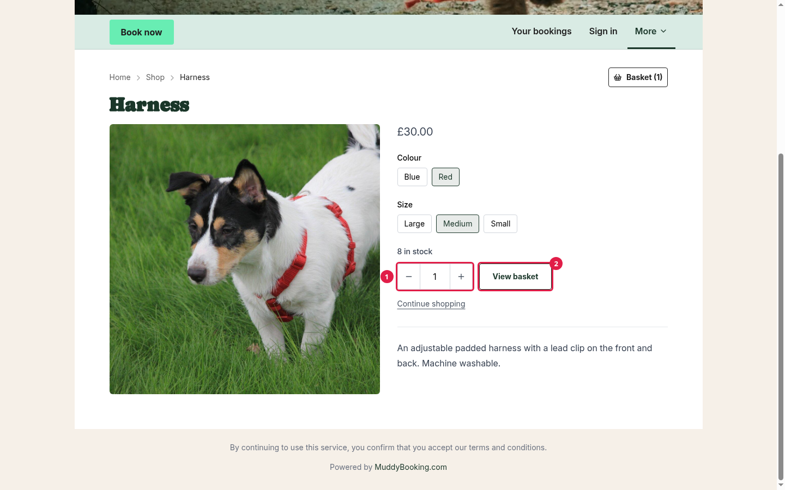

## The basket

The basket shows each item, its price and quantity, and an **Order summary** **(3)**.

Here they can:

- Change quantities **(1)** or remove items **(2)**.
- Enter a code in the **Discount or voucher code** box **(4)**. This works for discount codes, vouchers and gift cards. A delivery discount, such as free delivery, shows under **Delivery** once they've chosen their delivery at checkout.
- Check a voucher's balance, with **Check voucher balance** **(5)**.
- Pay straight away with Apple Pay or Google Pay, if their device supports it. With a voucher on the order, they use these on the payment step instead.
- Click **Checkout** **(6)** to continue.

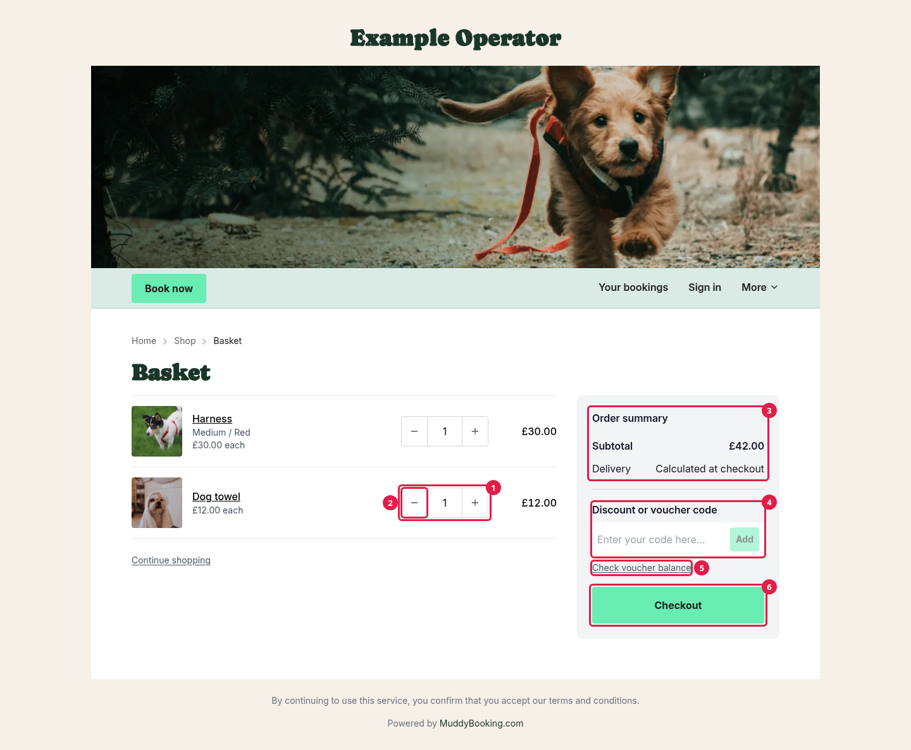

The basket shows **Calculated at checkout** for delivery, until they've chosen their delivery and clicked **Continue to payment**.

If something in their basket runs out or is taken off sale, Muddy updates the basket and tells them what changed.

## Checkout

Customers fill in one page, then pay on the next.

### Your details

Customers enter their **First name**, **Last name**, **Email** and **Phone** **(1)**. Their receipt and updates go to the email address. The phone number is so you can contact them about the order.

Customers don't need an account to buy. If they already have one, they can click **Already a customer? Sign in** **(2)**, and their details are filled in for them.

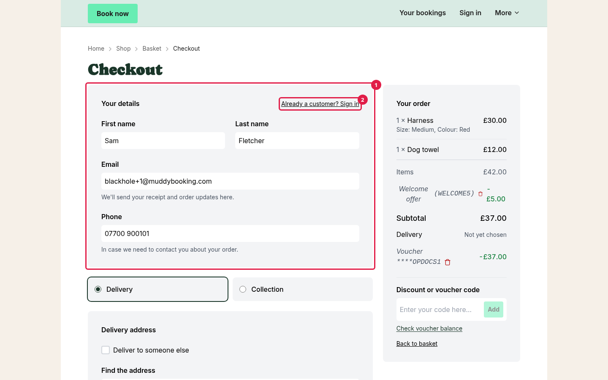

### Delivery or collection

If you offer both, customers choose **Delivery** or **Collection** **(1)**.

For delivery, they enter their address **(2)**. They can search for it, or enter it by hand. If the order is going to someone else, they tick **Deliver to someone else** **(3)** and enter the recipient's name.

Once they've entered their address, Muddy shows the delivery options you offer there, with their prices **(4)**. If you don't deliver to that address, they're told. If you've added a **Contact email address** or **Phone number** in **Business details**, they're also invited to get in touch with you.

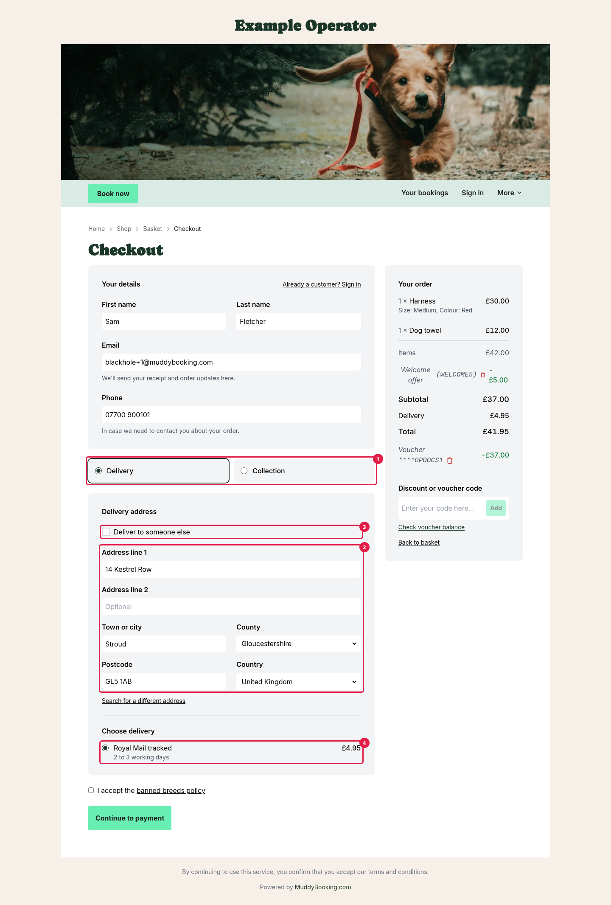

For collection, they see your collection points and instructions.

### Your policies

If you've added legal documents, or a [banned breeds policy](setting-up-banned-breeds.md), the checkout links to them just above **Continue to payment**. If **Require acceptance** is on, customers tick a box **(1)** to accept them. If it's off, they see a note saying that by continuing, they accept them. See [Setting up legal documents](setting-up-legal-documents.md).

### Paying

Customers click **Continue to payment** **(2)**, then pay by card.

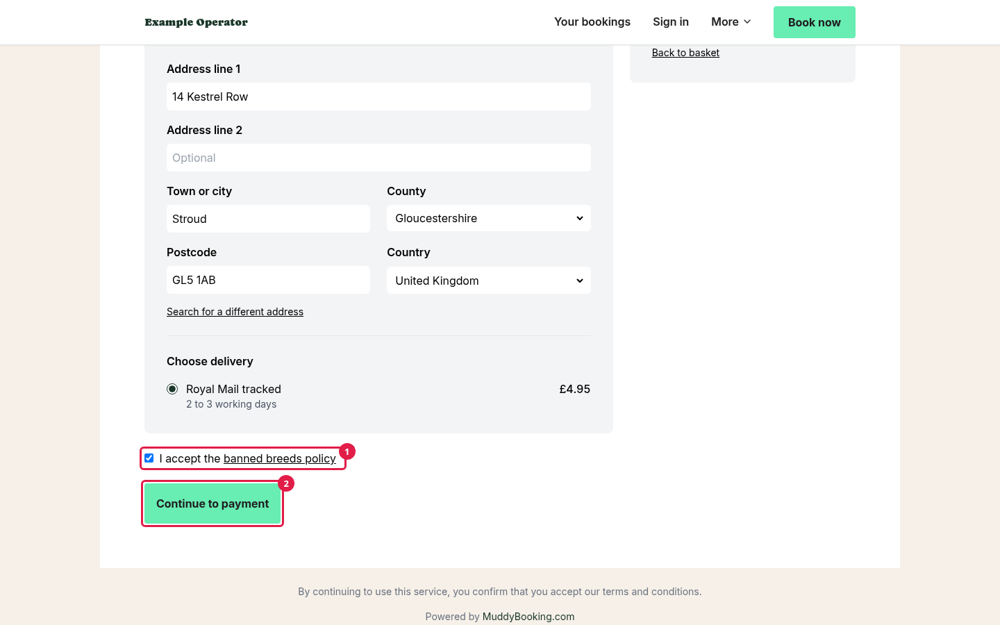

If vouchers or gift cards cover the whole order, including delivery **(1)**, they click **Pay with vouchers** **(2)** instead, and don't need a card.

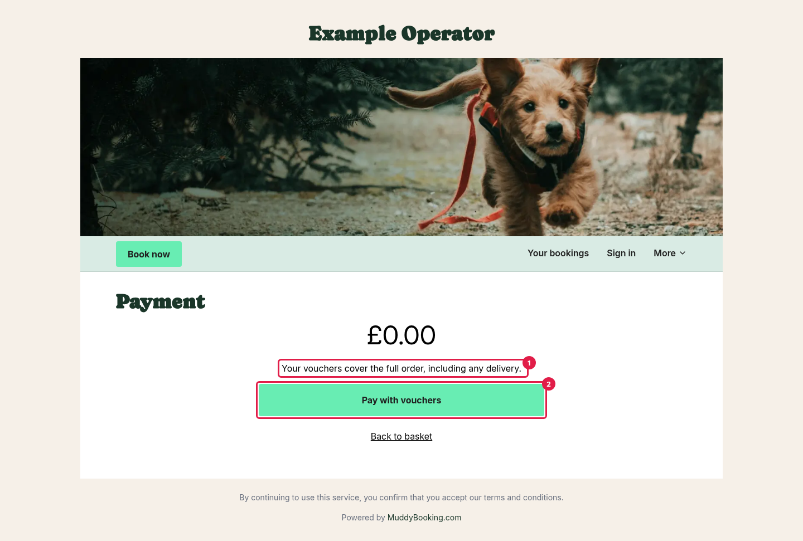

Vouchers can't be used on an order that contains a gift card.

## Apple Pay and Google Pay

On supported devices, Apple Pay and Google Pay buttons appear in the basket and at the top of checkout. Customers can pay in one step. Their wallet fills in their details and address, and shows your delivery options and prices.

Once a voucher or gift card is on the order, these one-step buttons are hidden, because they can't show the amount left to pay. Customers fill in the checkout page instead, and can still pay with Apple Pay or Google Pay on the payment step.

If the delivery price changes between the customer seeing it and paying, the payment is stopped and they're not charged. They're asked to use the checkout page instead.

## After paying

Customers see a thank-you message **(1)** and their order number **(2)**, and they're emailed a confirmation.

The order page shows what they ordered **(3)** and how it's progressing.

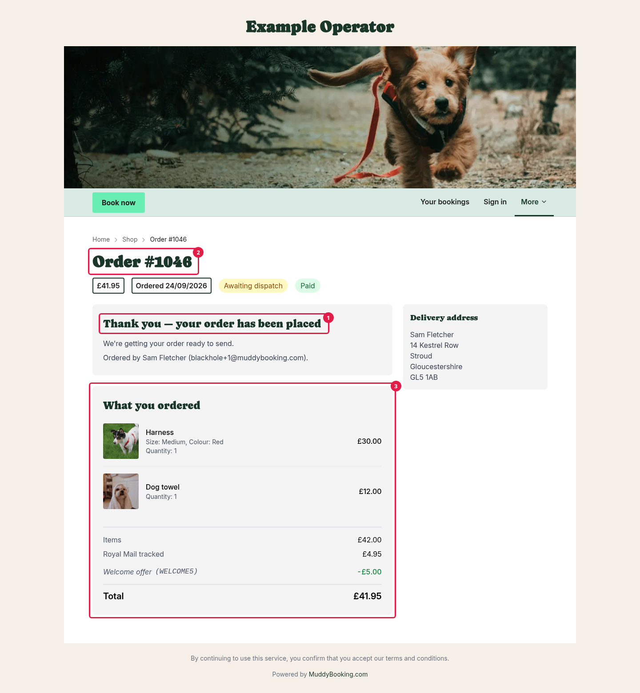

As you record dispatches, it tells them their order is on its way **(1)**, and shows each parcel and a tracking link **(2)**.

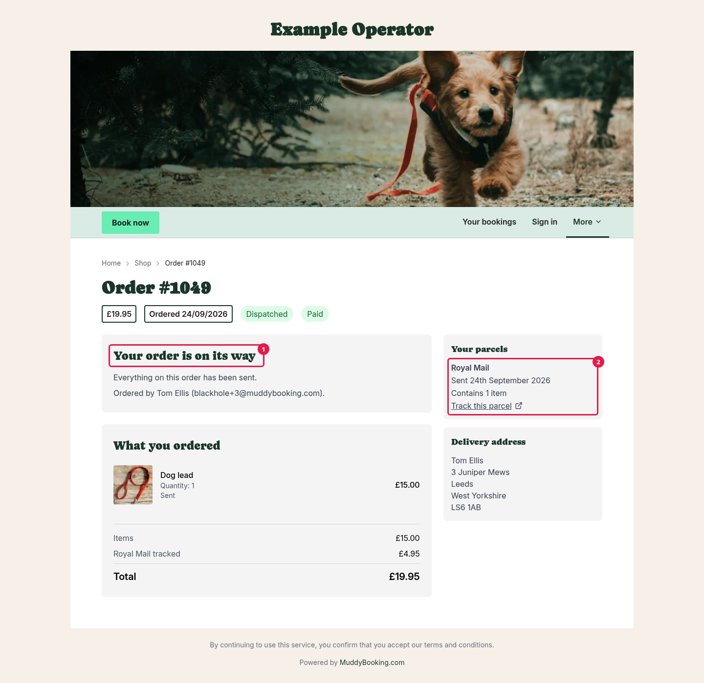

For collection orders, it shows where to collect from **(1)**, when it's ready, and that the order is complete once they've collected everything.

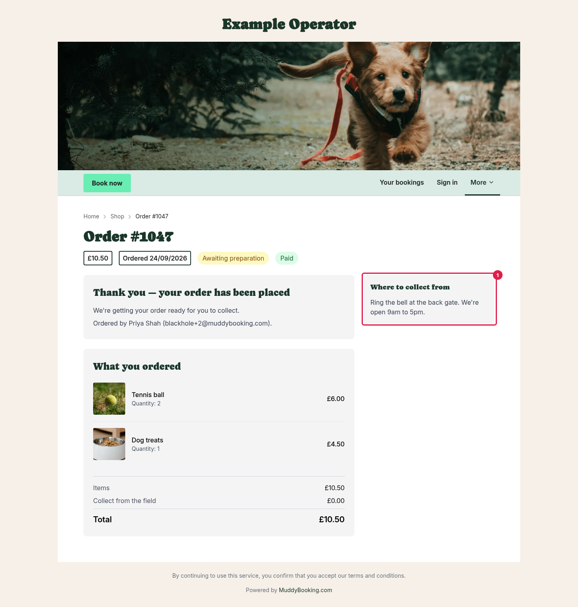

Customers can come back to the order page from the link in their emails, even if your shop is closed. On a different device from the one they ordered on, they need to sign in.

## Your orders

Customers with an account can see all their past orders under **Your orders**, in the account menu on your website. They need to sign in to see it.

If a customer checked out as a guest and can't see an order in **Your orders**, the order might be on a different customer record. You can move it to the right customer from the order page (see [Managing shop orders](managing-shop-orders.md)).
