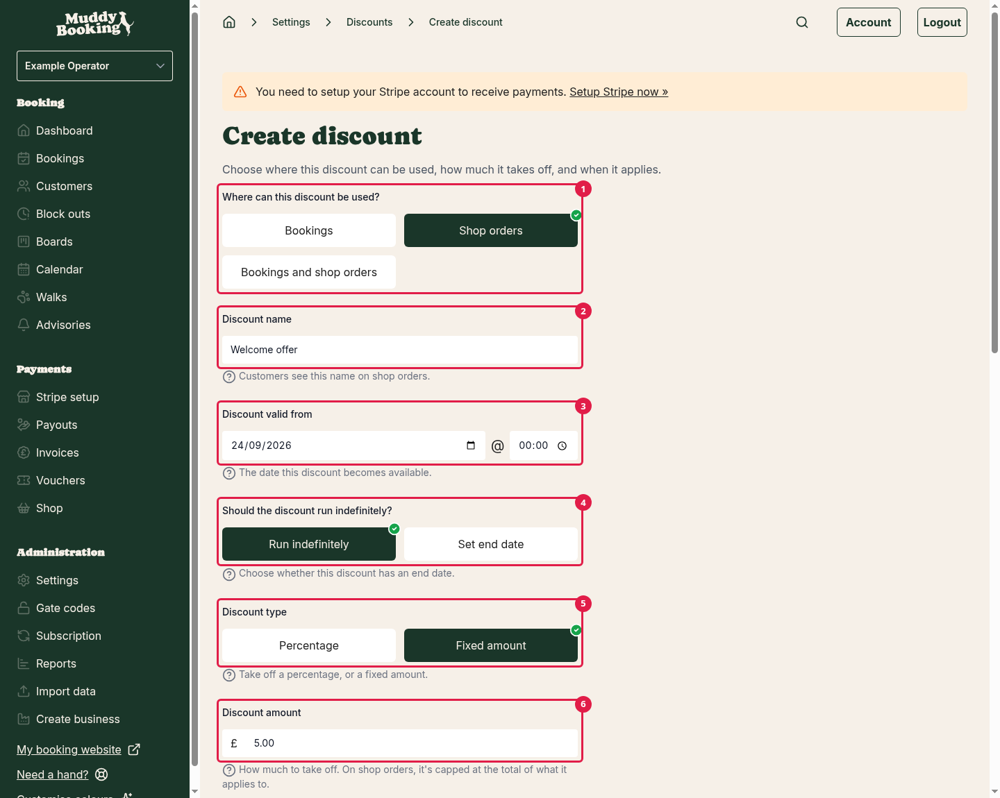
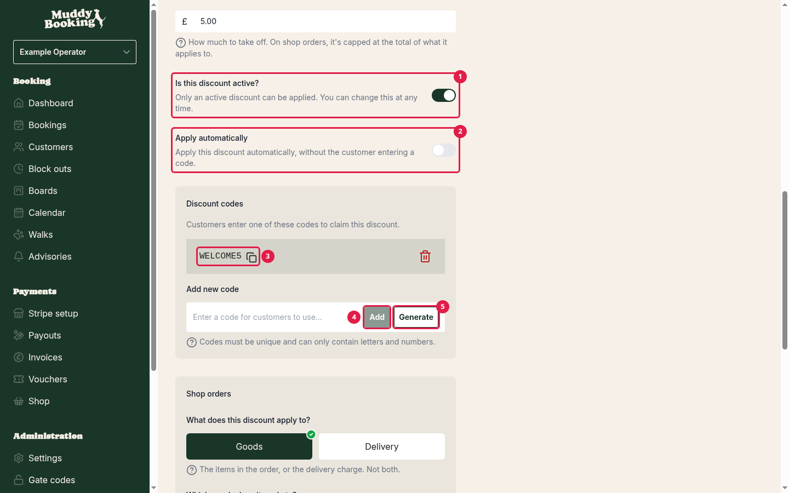
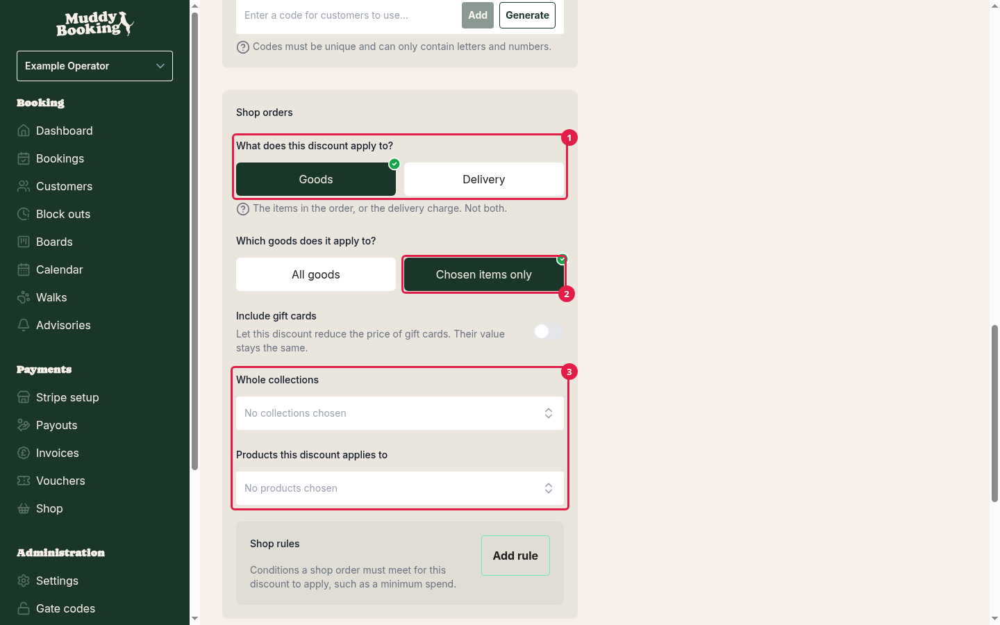
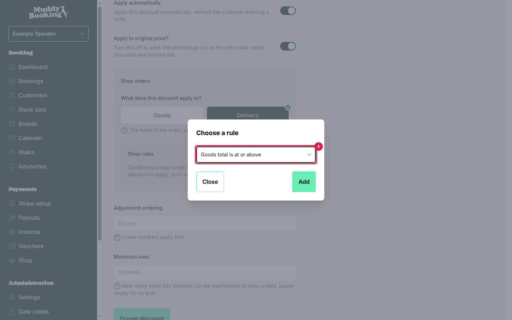
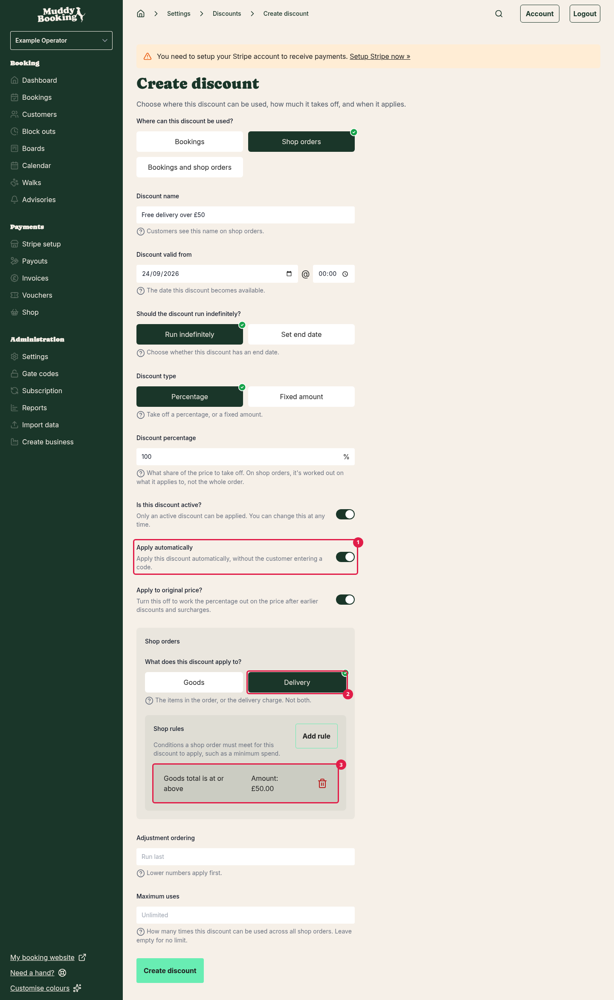
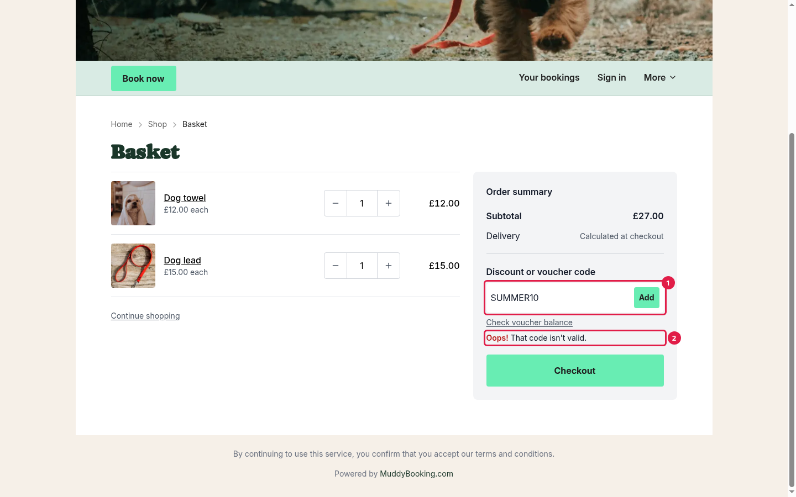
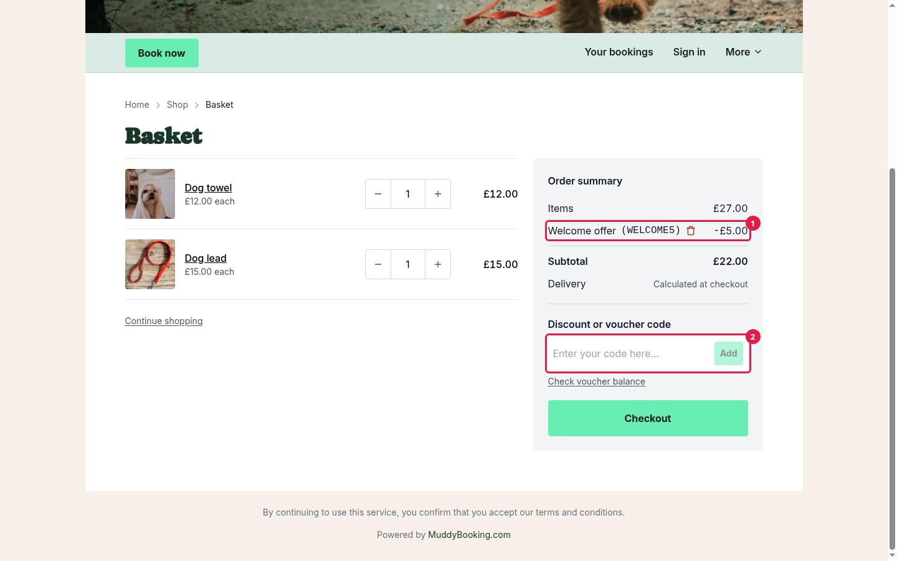

## How shop discounts work

Discounts take money off an order. In the shop, you can:

- Give customers a **code** to enter, such as **SUMMER10**.
- Apply a discount **automatically** when an order meets your rules, such as 10% off orders over £40.
- Take money off **the goods** or off **the delivery charge**.
- Take money off **everything**, or only **certain products or collections**.

The same discounts can also apply to bookings. When you create a discount, you choose whether it's for bookings, the shop, or both.

**Note:** surcharges only apply to bookings. They're never added to shop orders.

## Getting to discounts

Discounts are shared between bookings and the shop, so they live in your settings:

1. Go to **Settings**.
2. Click **Discounts**.

Once your shop is set up, you can also get there by clicking **Shop** in the left-hand menu, then **Discounts**.

## Creating a discount

1. On the **Discounts** page, click **Create**.
2. Fill in the details below.
3. Click **Create discount**.

### Where can this discount be used?

Choose **Shop orders** **(1)** for a discount that only works in the shop, or **Bookings and shop orders** for one that works on both. Choosing **Bookings** hides the shop settings.

### Discount name

Customers see this **(2)** in their basket and on their order, so make it clear, such as **Summer sale** or **Free delivery weekend**.

### Discount valid from, and end date

Choose when the discount starts **(3)**. Then choose **Run indefinitely** **(4)**, or **Set end date** to pick when it stops. This is useful for sales that only last a weekend.

### Discount type

- **Percentage**: takes a share off, such as 10%.
- **Fixed amount** **(5)**: takes a set amount off, such as £5.

### Discount amount or Discount percentage

How much to take off **(6)**. In the shop, this only comes off the items the discount applies to (see *What does this discount apply to?* below):

- A **percentage** is worked out on those items, not the whole order.
- A **fixed amount** can't take off more than those items cost. It's shared across the items in proportion to their prices.

### Is this discount active?

Only an active discount can be used. Switch this **(1)** off to pause a discount without deleting it.

### Apply automatically

- **Off** **(2)**: customers must enter a code. Add one or more codes **(3)** under **Discount codes**. Type your own and click **Add** **(4)**, or click **Generate** **(5)** for a random one. Codes can only contain letters and numbers, and must be different from every other code you use.
- **On**: the discount is added to any order that meets its rules, without a code. Customers can't remove an automatic discount.

### Maximum uses

The most times the discount can be used, across all orders (and bookings, if it applies to both). Leave it empty for no limit. This is handy for "first 50 customers" offers. A basket holding the discount counts as a use for an hour, even before the customer pays.

## Shop settings on a discount

When a discount can be used in the shop, a **Shop orders** section appears. It controls two separate things: **what the discount takes money off**, and **when it applies**.

### What does this discount apply to?

- **Goods**: the items in the order.
- **Delivery**: the delivery charge only. Use this for free or reduced delivery offers.

A discount applies to one or the other, not both. For money off both, create two discounts.

### Which goods does it apply to?

If you chose **Goods** **(1)**:

- **All goods**: every item in the order.
- **Chosen items only** **(2)**: only the products, variants or collections you pick. For example, 20% off only your **Treats** collection.

If you choose **Chosen items only**, you must pick at least one item **(3)**.

### Include gift cards

Gift cards aren't discounted unless you switch this on. Even with it on, the gift card keeps its full value. The customer just pays less for it.

### Shop rules

Rules set the conditions an order must meet before the discount applies. If you don't add any rules, the discount applies to every shop order (for automatic discounts), or to every order where the code is entered.

The rules you can add are:

- **Goods total is at or above** **(1)**: for example, orders of £40 or more.
- **Goods total is at or below**
- **Order contains one of these products**
- **Order contains one of these variants**
- **Order contains a product from one of these collections**: this includes products you add to the collection later.
- **Order contains a physical product**: the order has at least one physical product.
- **Must have no discounts**: the order has no other discount.
- **One of these customer groups**: the customer is signed in and is in at least one of the groups you pick.
- **Not in one of these customer groups**: the customer is signed in and isn't in any of the groups you pick.

An order must meet every rule you add.

To add a rule, click **Add rule** in the **Shop rules** box, choose one in the **Choose a rule** pop-up, then click **Add**. If the rule needs details, such as an amount or some products, fill them in and click **Close**. The rule is saved when you save the discount.

**Tip:** rules decide *when* a discount applies, not *what* it comes off. If you want 10% off treats whenever someone buys a treat, add the rule **Order contains a product from one of these collections** with your Treats collection, *and* set **Which goods does it apply to?** to **Chosen items only** with the same collection. Otherwise, the 10% comes off every item in the order.

The **Goods total** rules look at the total after any earlier discounts.

## Examples

**Free delivery on orders over £50**

- **Where can this discount be used?**: Shop orders
- **Discount type**: Percentage, **100**
- **Apply automatically**: on **(1)**
- **What does this discount apply to?**: Delivery **(2)**
- **Shop rules**: Goods total is at or above £50 **(3)**

You could also set this up with delivery rates instead. See [Setting up delivery and collection](setting-up-shop-delivery.md).

**£5 off with a code**

- **Discount type**: Fixed amount, **5**
- **Apply automatically**: off, with a code such as **WELCOME5**
- **What does this discount apply to?**: Goods, **All goods**

## When a customer has more than one discount

Discounts add up. Every automatic discount the order qualifies for is applied, as well as every code the customer enters.

They're applied in this order:

1. Discounts on goods come off first, then discounts on delivery.
2. Within each, discounts apply in the order they were added to the order. A code goes on when the customer enters it. An automatic discount goes on when the basket first qualifies for it.
3. If several automatic discounts qualify at the same moment, they go on in order of their **Adjustment ordering** number, lowest first.

For percentages, **Apply to original price?** decides how they add up:

- **On**: each percentage is worked out on the original price. So 10% and 20% off make 30% off.
- **Off**: the percentage is worked out on what's left after earlier discounts. So 10% off then 20% off makes 28% off.

## What customers see

Customers enter codes in the **Discount or voucher code** box **(1)**, in their basket or at checkout. If a code can't be used, they're told why **(2)**. For example, that the code isn't valid (which includes expired codes), that their order doesn't qualify, or that the code can't be used any more.

Each discount shows as its own line **(1)** in the basket and on the order, with the amount it took off. A discount on delivery shows under the **Delivery** line once the customer chooses delivery at checkout. If they enter its code earlier, such as in their basket, it's kept until then. After a code is added, the **Discount or voucher code** box empties, so the customer can enter another **(2)**.

Automatic discounts appear and disappear as the basket changes. If a customer adds enough to reach your minimum, the discount is added straight away. If they remove items and drop below it, it comes off again.

A code the customer entered stays on their order even if they change their basket so it no longer qualifies. It just doesn't take anything off until the basket qualifies again.

If a discount reaches its **Maximum uses** while a customer is checking out, it comes off their order before they pay, and they're told why.

## Vouchers aren't discounts

Customers also use the **Discount or voucher code** box for vouchers and gift cards, but these work differently. A discount lowers the price. A voucher is money the customer already has, so it's used to **pay** for the order. See [Selling gift cards](selling-gift-cards.md).
