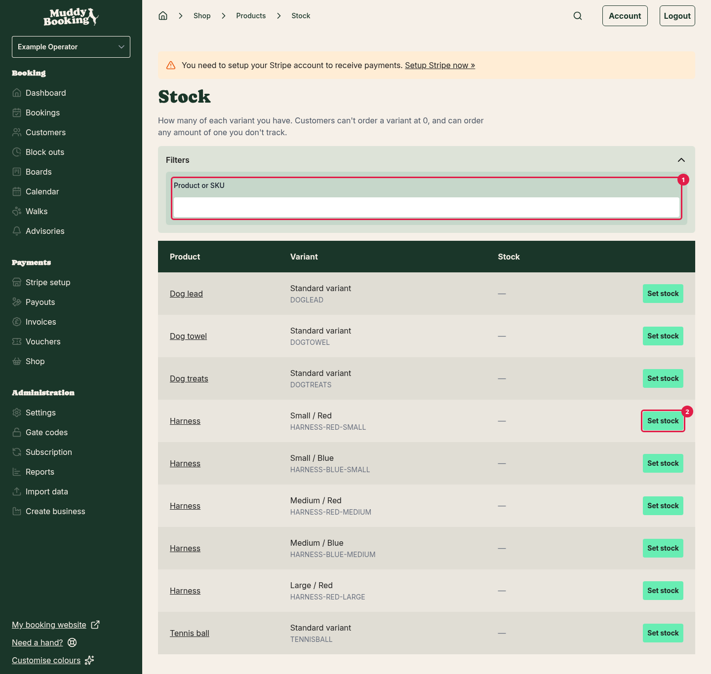
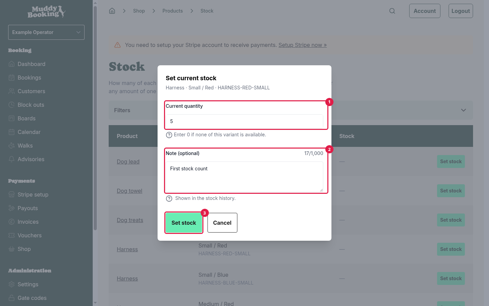
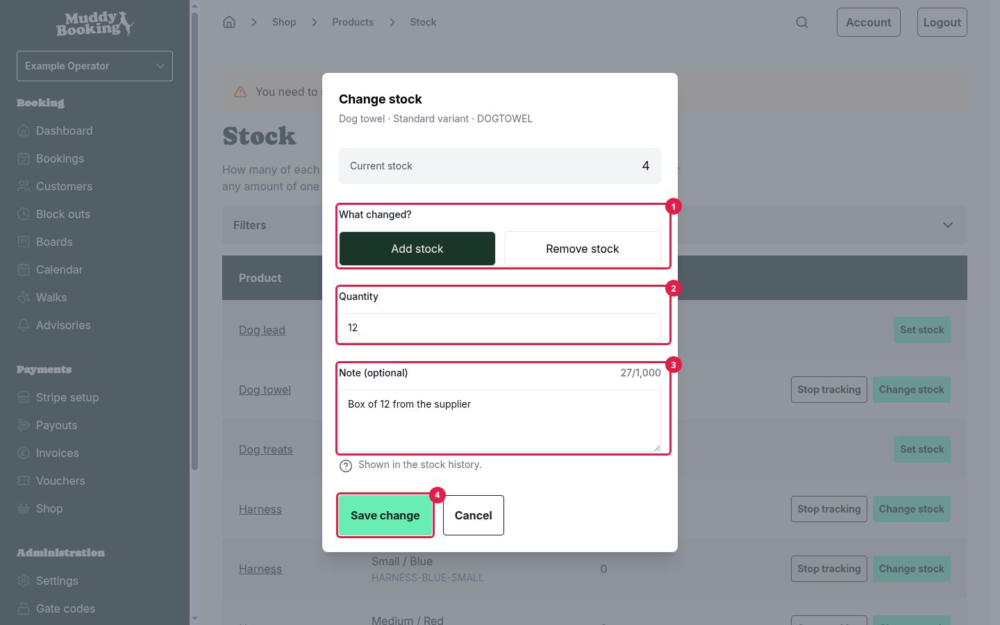
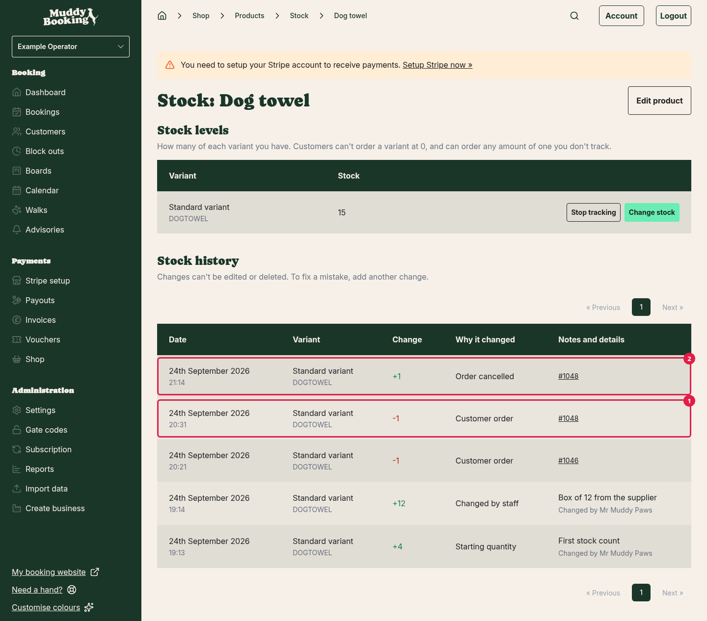
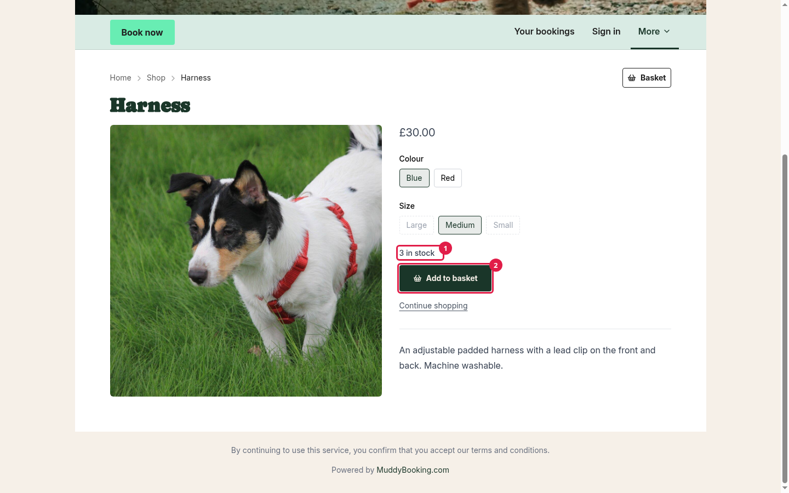
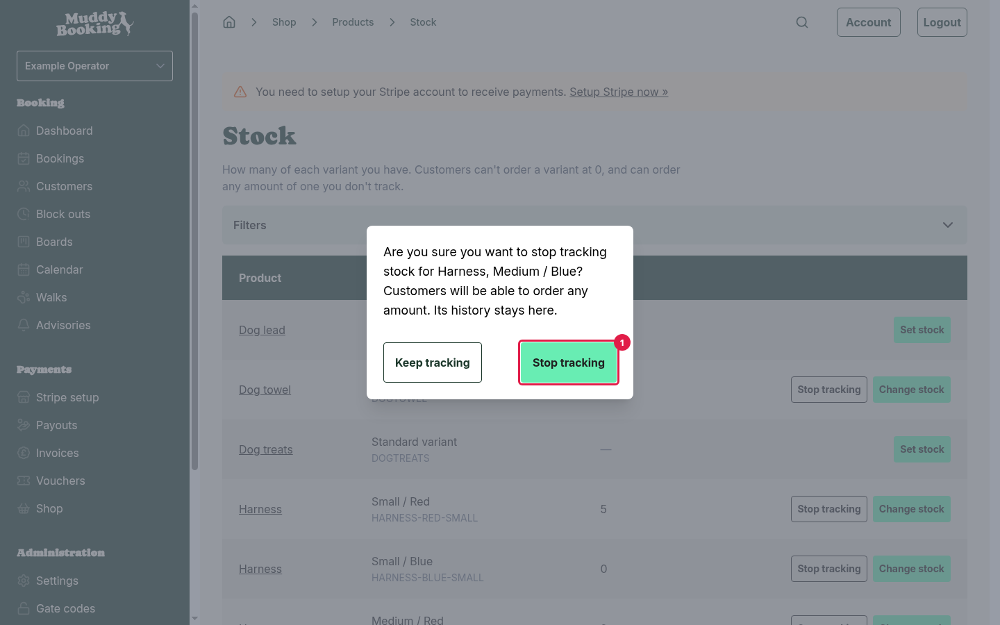

## Why track stock

If you tell Muddy how many of something you have, it counts down as customers buy, and it stops selling once you reach zero.

You don't have to track stock. For anything you don't track, customers can order as many as they like. This suits things you make to order, or things you never run out of.

You track stock for each **variant**, so you can track your Small harnesses separately from your Large ones. Gift cards never need stock.

## Getting to stock

1. Click **Shop** in the left-hand menu.
2. Click **Stock**.

The **Stock** tile appears once you've opened your shop for the first time. See [Setting up your shop for the first time](setting-up-your-shop.md#setting-up-your-shop-for-the-first-time).

The **Stock** page lists every variant of every product, with its current stock. To find something quickly, click **Filters** and use the **Product or SKU** **(1)** search.

You can set **(2)** and change stock straight from this page. To see the full record for a product, including its history, click the product's name. The same buttons are there too.

## Starting to track a variant

1. On the **Stock** page, find the variant.
2. Click **Set stock**.
3. Enter the **Current quantity** **(1)**, which is how many you have right now. Enter 0 if you have none.
4. Add a **Note** **(2)** if it would help your team. This is optional.
5. Click **Set stock** **(3)**.

From now on, Muddy keeps count for this variant.

## Updating stock

Use this when a delivery arrives, when something gets damaged, or when a stock count doesn't match.

1. On the **Stock** page, find the variant.
2. Click **Change stock**.
3. Under **What changed?** **(1)**, choose **Add stock** or **Remove stock**.
4. Enter the **Quantity** **(2)** to add or remove.
5. Add a **Note** **(3)** explaining why, such as "Damaged in transit". This is optional, but it helps later.
6. Click **Save change** **(4)**.

You enter the difference, not the new total. So if you had 4 and a box of 12 arrives, choose **Add stock** and enter **12**.

## What changes stock automatically

You don't need to update stock for orders. Muddy does it for you:

- **When a customer pays for an order**, the items come off your stock.
- **When you cancel an order**, the items go back on.
- **When you record a return** and choose to put the items back into stock, they go back on.

Stock comes off when the customer **pays**, not when they add something to their basket. Items in someone's basket are still available to other customers.

## Stock history

Every change is listed under **Stock history**, with the date, the variant, how much changed, and why. The reasons you'll see are:

- **Starting quantity**: when you first set the stock.
- **Changed by staff**: a change you or your team made.
- **Customer order** **(1)**: sold to a customer.
- **Customer return**: put back after a return.
- **Order changed**: an order was changed after it was placed.
- **Order cancelled** **(2)**: put back after you cancelled an order.
- **Stopped tracking**: when someone stopped tracking stock for the variant.

You can't edit or delete past changes. If something is wrong, add a new change to correct it. That way the history always shows what really happened.

## What customers see

- Customers see how many are left, such as **3 in stock** **(1)**, above the **Add to basket** **(2)** button. At 10 or more, they see **10+ in stock**.
- If a product has options, out-of-stock choices are greyed out. Clicking one switches to a combination that's in stock, if there is one.
- Once every variant you sell is at zero, customers see **Out of stock**, and the **Add to basket** button is greyed out. The product still appears in your shop.
- Customers can't add more to their basket than you have.
- If something runs out while it's in a customer's basket, Muddy reduces or removes it and tells them why.

## If two customers buy the last one

Because stock only comes off at payment, two customers can occasionally pay for the last item at almost the same time. Muddy won't refuse a payment that has already gone through, so both orders are placed.

When this happens, your stock goes below zero (shown in red), and you get an email with the subject **Not enough stock for order**, followed by the order number. You can then decide what to do. You might find another one, or contact the customer and cancel their order, which refunds them in full. See [Managing shop orders](managing-shop-orders.md).

## Stopping tracking

If you no longer want Muddy to count a variant:

1. On the **Stock** page, find the variant.
2. Click **Stop tracking**.
3. Click **Stop tracking** **(1)** to confirm.

Customers can then order any amount of that variant. Its stock history is kept.

## Variants you no longer sell

If you untick a variant on a product, it's hidden from the **Stock** page. If you still track its stock, switch on **Show variants no longer for sale** to see it again. Its past changes stay in the product's **Stock history**.

If a variant you no longer sell still has stock, Muddy reminds you on the **Products** page. You might want to remove that stock, or sell the variant again.
